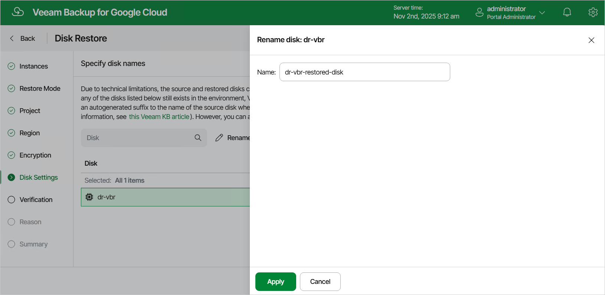

In this article

[This step applies only if you have selected the Restore to new location, or with different settings option at the Restore Mode step of the wizard]

At the Disk Settings step of the wizard, you can specify a new name for each restored persistent disk:

1. Select the necessary disk and click Rename.
2. In the Rename disk window, specify a name for the disk and click Apply.

|  |
| --- |
| Tip |
| If Veeam Backup for Google Cloud is unable to restore the disk using the specified name for some reason, the wizard will display a warning icon in the Disk column. To learn what this reason is, hover your mouse over the icon. |

Page updated 11/4/2025

Page content applies to build 7.0.0.47
