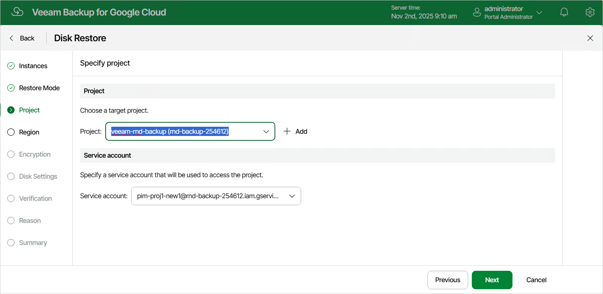

In this article

[This step applies only if you have selected the Restore to new location, or with different settings option at the Restore Mode step of the wizard]

At the Project step of the wizard, select a project to which the restored persistent disks will belong and specify a service account whose permissions will be used to perform the restore operation. For more information on the required permissions, see [Service Account Permissions](restore_permissions.md#vm).

For a project to be displayed in the Project drop-down list, it must be added to Veeam Backup for Google Cloud as described in section [Adding Projects and Folders](adding_projects.md). If you have not added the necessary project to Veeam Backup for Google Cloud beforehand, you can do it without closing the VM Instance Restore wizard. To do that, click Add and complete the Add Projects and Folders wizard.

For a service account to be displayed in the list of available accounts, it must be added to Veeam Backup for Google Cloud as described in section [Adding Service Accounts](adding_service_accounts.md), and must be assigned permissions required to access the selected project as described in section [Adding Projects and Folders](adding_projects.md).

Page updated 11/4/2025

Page content applies to build 7.0.0.47
