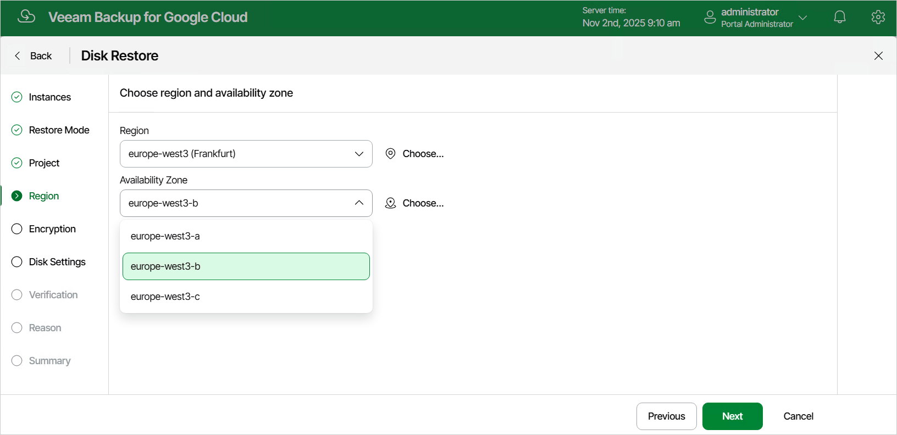

# Step 6. Select Region and Availability Zone

[This step applies only if you have selected the Restore to new location, or with different settings option at the Restore Mode step of the wizard]

At the Region step of the wizard, select a region and an availability zone to which the restored persistent disks will be placed.

