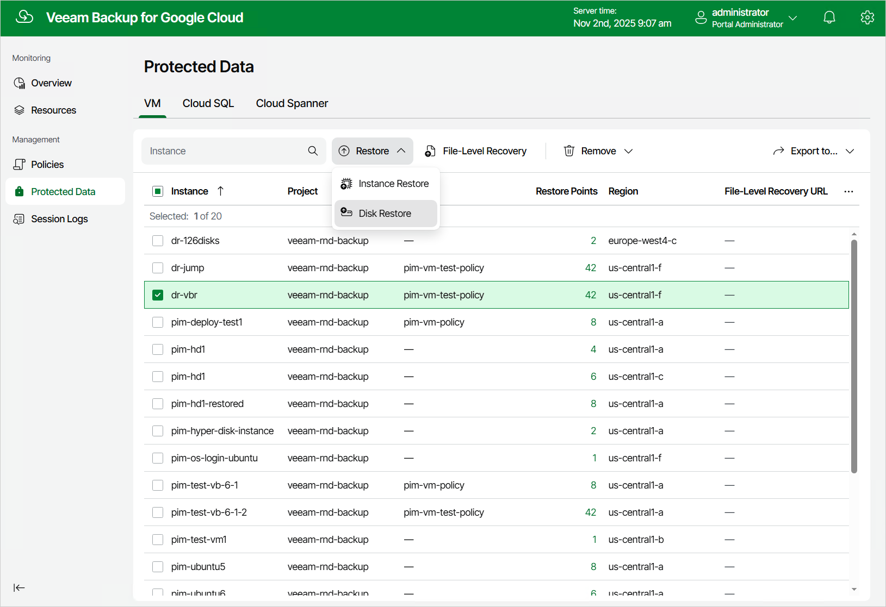

In this article

To launch the Disk Restore wizard, do the following:

1. Navigate to Protected Data > VM.
2. Select the VM instance whose persistent disks you want to restore, and click Restore > Disk Restore.

Page updated 11/4/2025

Page content applies to build 7.0.0.47
