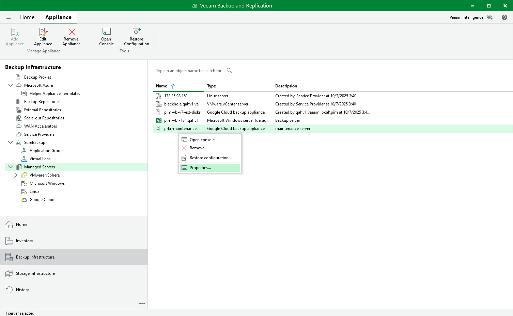

# Editing Appliance Settings

For each backup appliance managed by the backup server, you can modify the settings configured while adding the appliance to the backup infrastructure:

1. In the Veeam Backup & Replication console, open the Backup Infrastructure view.
2. Navigate to Managed Servers.
3. Select the necessary backup appliance and click Edit Appliance on the ribbon.

Alternatively, you can right-click the appliance and select Properties.

1. Complete the Edit Veeam Backup for Google Cloud Appliance wizard:

1. To change the service account that is used to connect to the appliance, follow the instructions provided in section [Connecting to Existing Appliances](connect_appliance_account.md) (step 1).
2. To provide a new description for the appliance, follow the instructions provided in section [Connecting to Existing Appliances](connect_appliance_instance.md) (step 4).
3. To change the way Veeam Backup & Replication connects to the appliance, follow the instructions provided in section [Connecting to Existing Appliances](connect_appliance_connection.md) (step 5).
4. To change the user whose credentials Veeam Backup & Replication uses to connect to the appliance, follow the instructions provided in section [Connecting to Existing Appliances](connect_appliance_creds.md) (step 6).
5. To edit settings of the appliance repositories added to the backup infrastructure, follow the instructions provided in section [Connecting to Existing Appliances](connect_appliance_repo.md) (step 7).
6. At the Apply step of the wizard, wait for the changes to be applied and click Next.
7. At the Summary step of the wizard, review summary information and click Finish to confirm the changes.

