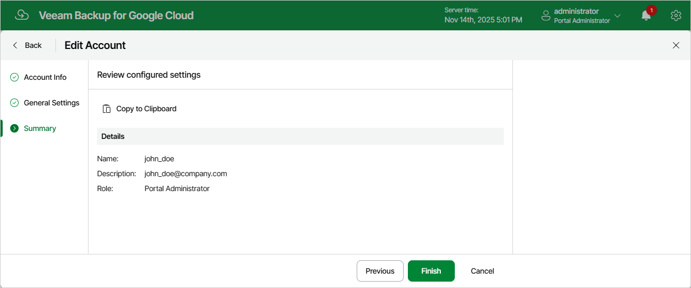

In this article

For each user account, you can modify settings configured while adding the account:

1. Switch to the Configuration page.
2. Navigate to Accounts > Portal Users.
3. Select the account and click Edit.
4. Complete the Edit Account wizard:

1. To specify a new name and description for the account, follow the instructions provided in section [Adding User Accounts](backup_admin_name.md) (step 2).
2. To choose a new role for the account, follow the instructions provided in section [Adding User Accounts](backup_admin_password.md) (step 3).
3. At the Summary step of the wizard, review summary information and click Finish to confirm the changes.

Page updated 11/14/2025

Page content applies to build 7.0.0.47
