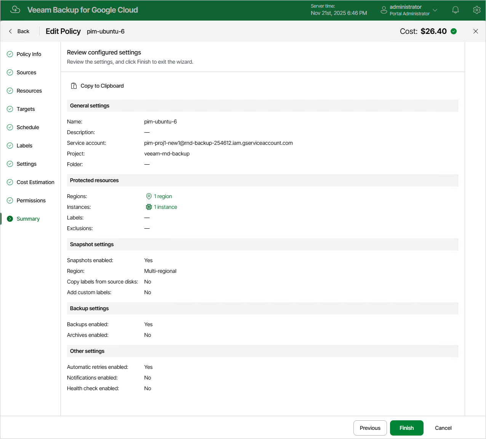

# Editing Backup Policy Settings

For each backup policy, you can modify settings configured while creating the policy:

1. Navigate to Policies.
2. Switch to the necessary tab and select the backup policy.
3. Click Edit.
4. Complete the Edit Policy wizard:

1. To provide a new name and description for the policy, follow the instructions provided in section [Performing VM Backup](backup_policy_name.md) (step 2), [Performing SQL Backup](sql_policy_name.md) (step 2) or [Performing Spanner Backup](spanner_policy_name.md) (step 2).
2. To choose another project or folder that manages resources that you want to protect, or change the service account whose permissions are used to perform backup operations, follow the instructions provided in section [Performing VM Backup](backup_policy_project.md) (step 3), [Performing SQL Backup](sql_policy_project.md) (step 3) or [Performing Spanner Backup](spanner_policy_project.md) (step 3).

|  |
| --- |
| Important |
| If you change the project, folder or service account, it is recommended that you check whether the selected service account has all the permissions required to perform data protection tasks in the specified entity. To do that, follow the instructions provided in section [Performing VM Backup](backup_policy_permissions.md) (step 10), [Performing SQL Backup](sql_policy_permissions.md) (step 10) or [Performing Spanner Backup](spanner_policy_permissions.md) (step 10). |

1. To modify the list of regions in which instances that you plan to back up reside, or to add instances to the backup scope, follow the instructions provided in section Performing VM Backup ([step 4a](backup_policy_regions.md) or [step 4b](backup_policy_instances.md)), Performing SQL Backup ([step 4a](sql_policy_regions.md) or [step 4b](sql_policy_instances.md)) or Performing Spanner Backup ([step 4a](spanner_policy_regions.md) or [step 4b](spanner_policy_instances.md)).
2. To instruct Veeam Backup for Google Cloud to create image-level backups, follow the instructions provided in section [Performing VM Backup](backup_policy_target.md) (step 5), [Performing SQL Backup](sql_policy_target.md) (step 5) or [Performing Spanner Backup](spanner_policy_target.md) (step 5).
3. To modify the schedule configured for the policy, follow the instructions provided in section [Performing VM Backup](backup_policy_schedule.md) (step 6), [Performing SQL Backup](sql_policy_schedule.md) (step 6) or [Performing Spanner Backup](spanner_policy_schedule.md) (step 6).
4. [Applies only to VM backup policies] To assign labels to cloud-native snapshots, follow the instructions provided in section [Performing VM Backup](backup_policy_labels.md) (step 7).
5. [Applies only to SQL backup policies] To choose whether you want to use a staging server to perform backup, follow the instructions provided in section [Performing SQL Backup](sql_policy_processing.md) (step 7).
6. To configure automatic retry, health check and notification settings, follow the instructions provided in section [Performing VM Backup](backup_policy_notifications.md) (step 8), [Performing SQL Backup](sql_policy_notifications.md) (step 8) or [Performing Spanner Backup](spanner_policy_notifications.md) (step 8).
7. At the Summary step of the wizard, review configuration information and click Finish to confirm the changes.

Related Topics

[Setting Backup Policy Priority](backup_policy_priority.md)

