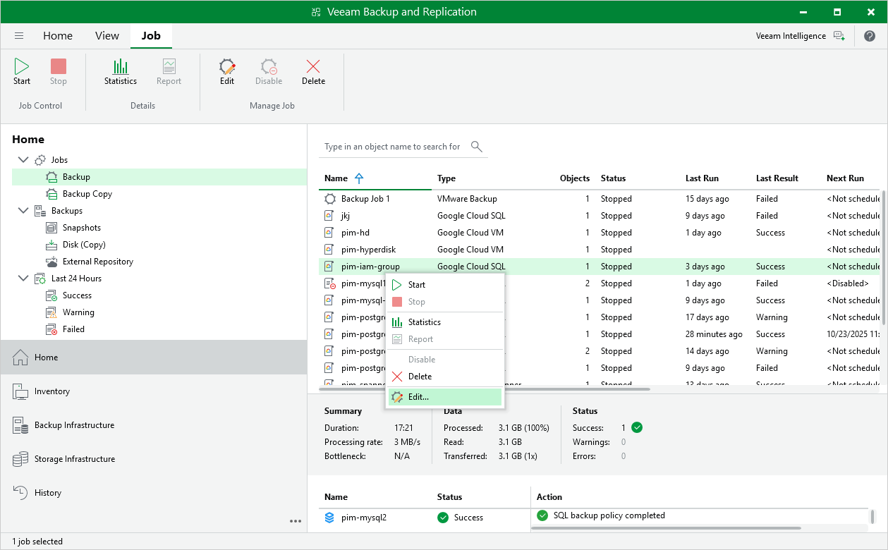

# Editing Backup Policy Settings

You can edit backup policies in the Veeam Backup for Google Cloud Web UI only. However, you can launch the edit policy wizard directly from the Veeam Backup & Replication console:

1. In the Veeam Backup & Replication console, open the Home view.
2. Navigate to Jobs.
3. Select the necessary policy and click Edit on the ribbon.

Alternatively, you can right-click the policy and select Edit.

Veeam Backup & Replication will open the Edit Policy wizard in a web browser. Complete the wizard as described in section [Editing Backup Policy Settings](editing_backup_policies.md).

