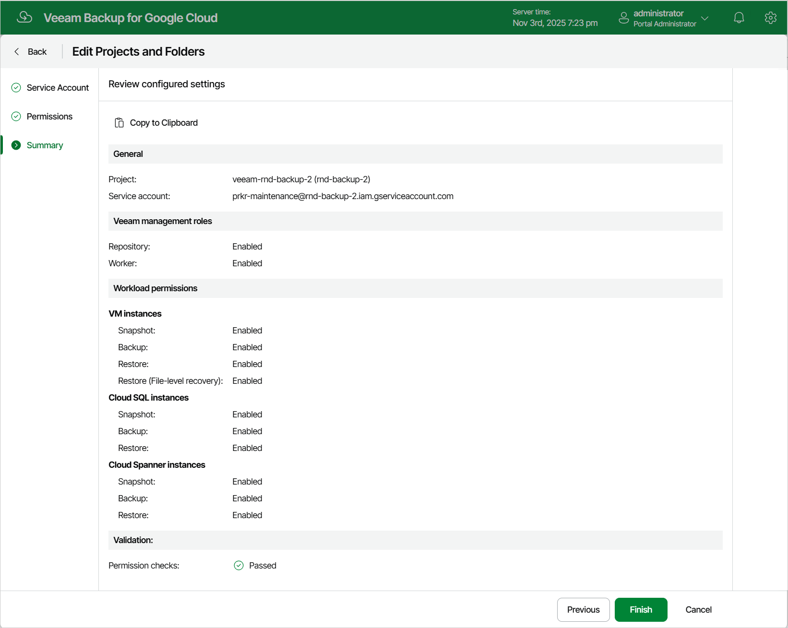

# Editing Projects and Folders

For each project or folder, you can modify settings configured while adding the entity:

1. Switch to the Configuration page.
2. Navigate to Infrastructure > Projects & Folders.
3. Select the project or folder and click Edit.

1. Complete the Edit Projects and Folders wizard:

1. To modify the list of operations that Veeam Backup for Google Cloud can perform for the project or folder, follow the instructions provided in section [Adding Projects and Folders](project_tasks.md) (step 3).

1. To check and assign the required permissions to the selected service account, follow the instructions provided in section [Adding Projects and Folders](project_permissions.md) (step 5).

|  |
| --- |
| Note |
| The service account that is used to access the project in which the backup appliance resides (that is, the project specified during the product installation) can only be changed in the Google Cloud console, as described in [Google Cloud documentation](https://cloud.google.com/compute/docs/instances/change-service-account). |

1. At the Summary step of the wizard, review configuration information and click Finish to confirm the changes.

