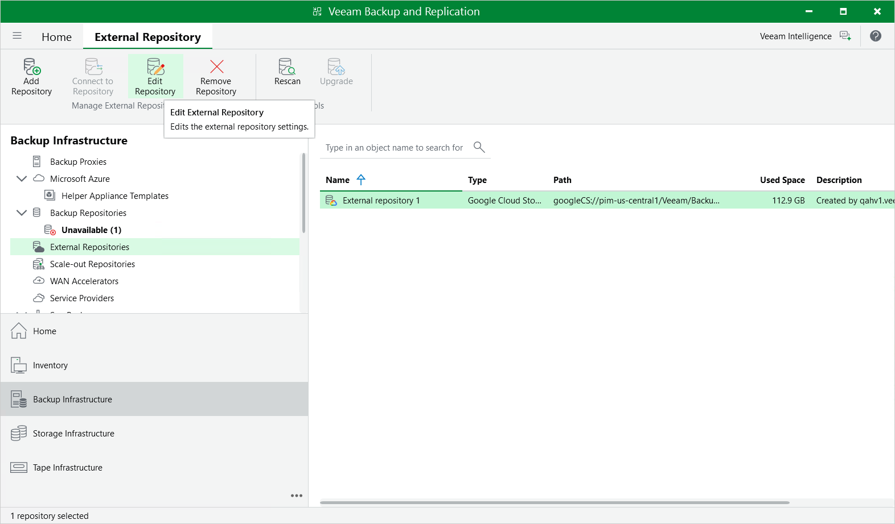
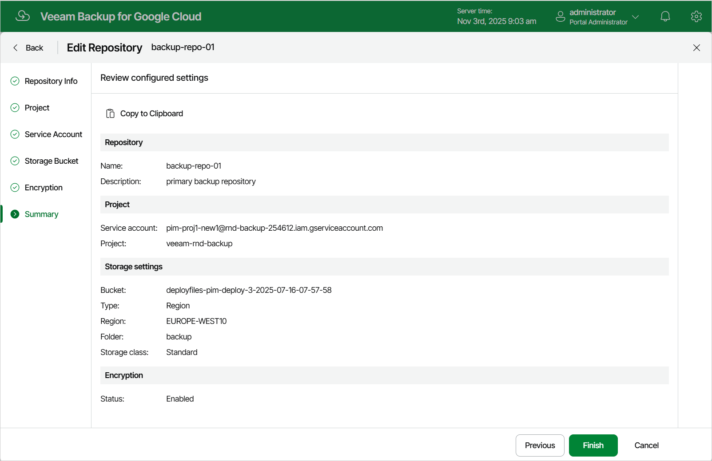

# Editing Backup Repositories

The settings that you can modify for a backup repository depend on whether the repository has been added to the backup infrastructure using the Veeam Backup & Replication console or the Veeam Backup for Google Cloud Web UI.

Editing Backup Repository Settings Using Console

For each standard backup repository, you can modify settings configured while adding the repository to the backup infrastructure:

1. In the Veeam Backup & Replication console, open the Backup Infrastructure view.
2. Navigate to External Repositories.
3. Select the necessary repository and click Edit Repository on the ribbon.

Alternatively, you can right-click the repository and select Properties.

1. Complete the Edit External Repository wizard:

1. To specify a new name and description for the repository, follow the instructions provided in section [Creating New Repositories](add_repo_appliance.md) (step 2).
2. To change the HMAC key and the gateway server used to access the repository, follow the instructions provided in section [Creating New Repositories](add_repo_project.md) (step 3).
3. To enable encryption or change the encryption settings of the repository, follow the instructions provided in section [Creating New Repositories](add_repo_bucket.md) (step 4).

|  |
| --- |
| Important |
| If you change the encryption settings of a standard backup repository using the Veeam Backup & Replication console, Veeam Backup & Replication will not propagate these settings to the backup appliance automatically. Consider updating the settings manually as described in section [Editing Backup Repository Settings Using Veeam Backup for Google Cloud Web UI](#editing_repo_settings). |

1. At the Apply step of the wizard, wait for the changes to be applied and click Next.
2. At the Summary step of the wizard, review summary information and click Finish to confirm the changes.

Editing Backup Repository Settings Using Web UI

For each backup repository, you can modify settings configured while adding the repository to Veeam Backup for Google Cloud:

1. Switch to the Configuration page.
2. Navigate to Repositories.
3. Select the repository and click Edit.
4. Complete the Edit Repository wizard:

1. To provide a new name and description for the repository, follow the instructions provided in section [Adding Backup Repositories](repository_name.md) (step 2).
2. To change the HMAC key used to authenticate requests to the backup repository, follow the instructions provided in section [Adding Backup Repositories](repository_account.md) (step 4).
3. To enable encryption or change the encryption settings for the repository, follow the instructions provided in section [Adding Backup Repositories](repository_encryption.md) (step 6).
4. At the Summary step of the wizard, review summary information and click Finish to confirm the changes.

As soon as you click Finish, Veeam Backup for Google Cloud will start modifying the backup repository settings. To track the progress, click Go to Sessions in the Session Info window to proceed to the [Session Logs page](viewing_session_statistics.md).

