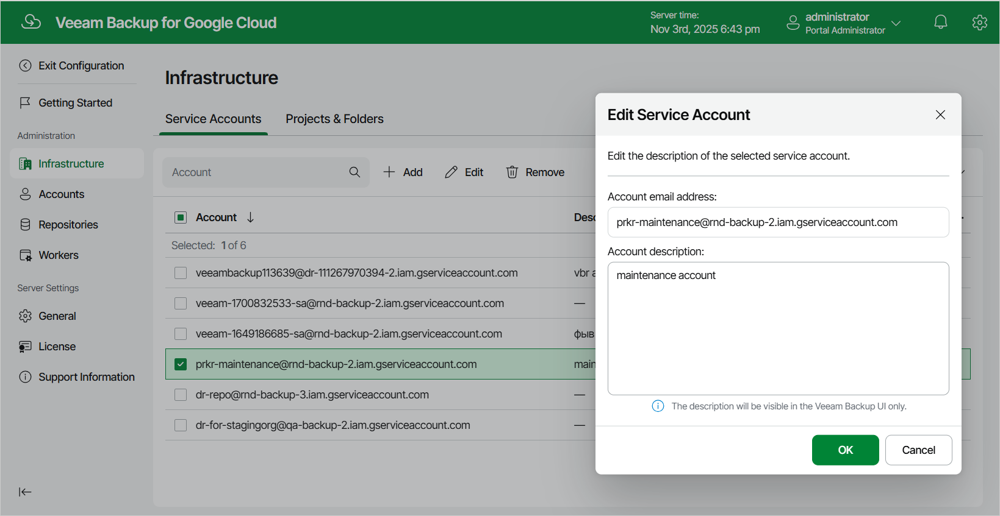

In this article

For each service account, you can only edit the description provided while adding the account:

1. Switch to the Configuration page.
2. Navigate to Infrastructure > Service Accounts.
3. Select the service account and click Edit.

1. In the Edit Service Account window, modify the description of the account and click OK.

Page updated 11/14/2025

Page content applies to build 7.0.0.47
