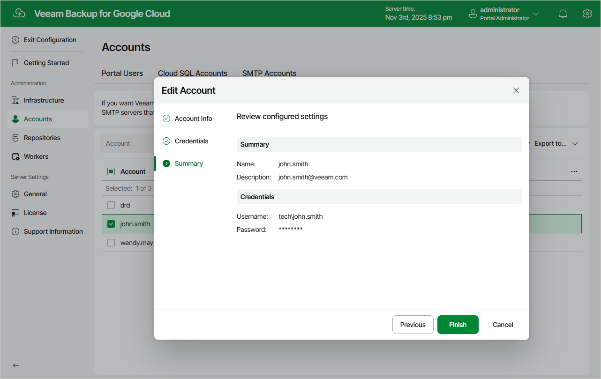

In this article

For each SMTP account, you can modify settings configured while creating the account:

1. Switch to the Configuration page.
2. Navigate to Accounts > SMTP Accounts.
3. Select the account and click Edit.

1. Complete the Edit Account wizard:

1. To provide a new name and description for the account, follow the instructions provided in section [Adding SMTP Accounts](smtp_account_name.md) (step 2).
2. To specify credentials of another user account to be used to authenticate against the SMTP server, follow the instructions provided in section [Adding SMTP Accounts](smtp_account_credentials.md) (step 3).
3. At the Summary step of the wizard, review summary information and click Finish to confirm the changes.

Page updated 11/12/2025

Page content applies to build 7.0.0.47
