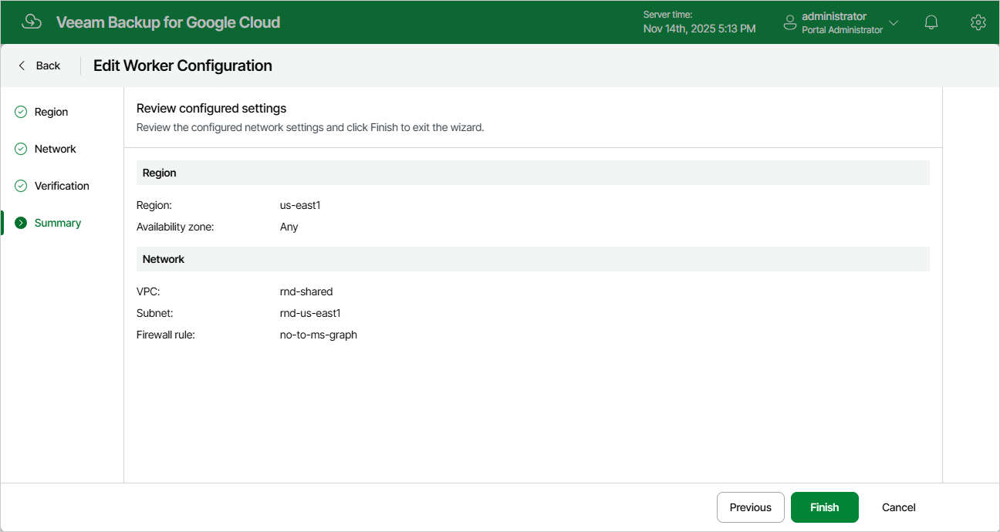

In this article

For each worker configuration, you can modify settings specified while adding the worker configuration to Veeam Backup for Google Cloud:

1. Switch to the Configuration page.
2. Navigate to Workers > Network.
3. Select the worker configuration and click Edit.
4. Complete the Edit Worker Configuration wizard:

1. To modify the VPC network and subnet to which the related worker instances are connected, and to change the firewall rule associated with the specified network, follow the instructions provided in section [Adding Worker Configurations](worker_network_settings.md) (step 3).
2. At the Summary step of the wizard, review configuration information and click Finish to confirm the changes.

|  |
| --- |
| Note |
| If there are any worker instances created based on the selected configuration that are currently involved in a backup or restore process, the changes will be applied only when the process completes. |

Page updated 11/14/2025

Page content applies to build 7.0.0.47
