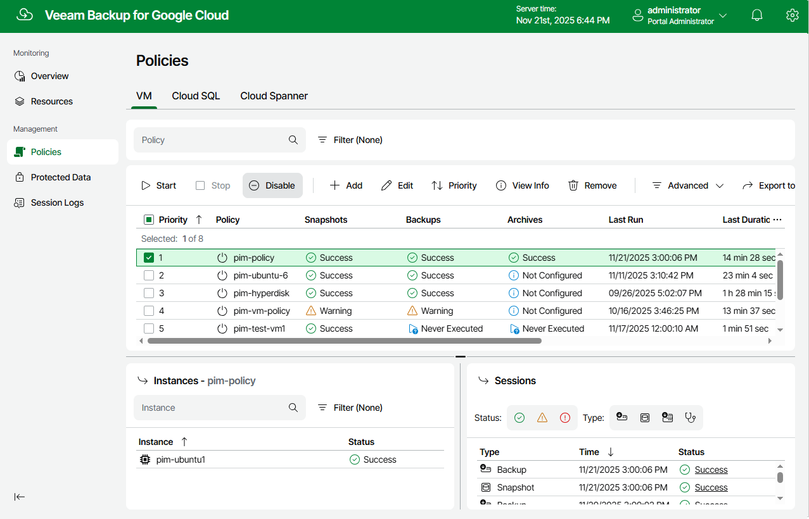

In this article

By default, Veeam Backup for Google Cloud runs all created backup policies according to the specified schedules. However, you can temporarily disable a backup policy so that Veeam Backup for Google Cloud does not run the backup policy automatically. You will still be able to [manually start](starting_stopping_backup_policies.md) or enable the disabled backup policy at any time you need.

To enable or disable a backup policy, do the following:

1. Navigate to Policies.
2. Switch to the necessary tab and select the backup policy.
3. Click Enable or Disable.

Page updated 11/21/2025

Page content applies to build 7.0.0.47
