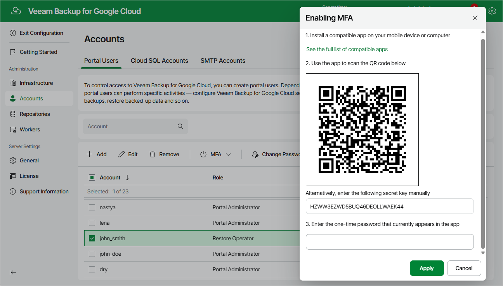

# Enabling Multi-Factor Authentication

Multi-factor authentication (MFA) in Veeam Backup for Google Cloud is based on the Time-based One-Time Password (TOTP) method that requires the user to verify their identity by providing a temporary six-digit code generated by an authentication application running on a trusted device.

To enable MFA for a user account, do the following:

1. Switch to the Configuration page.
2. Navigate to Accounts > Portal Users.
3. Select the account and click MFA > Enable.
4. Follow the instructions provided in the Enabling MFA window:

1. Install a supported authentication application on a trusted device. To view the list of authentication applications supported by Veeam Backup for Google Cloud, click See the full list of compatible apps.

|  |
| --- |
| Note |
| Only Google Authenticator is fully supported by Veeam Backup for Google Cloud. |

1. Scan the displayed QR code using the camera of the trusted device.
2. Enter a verification code generated by the authentication application.
3. Click Apply.

