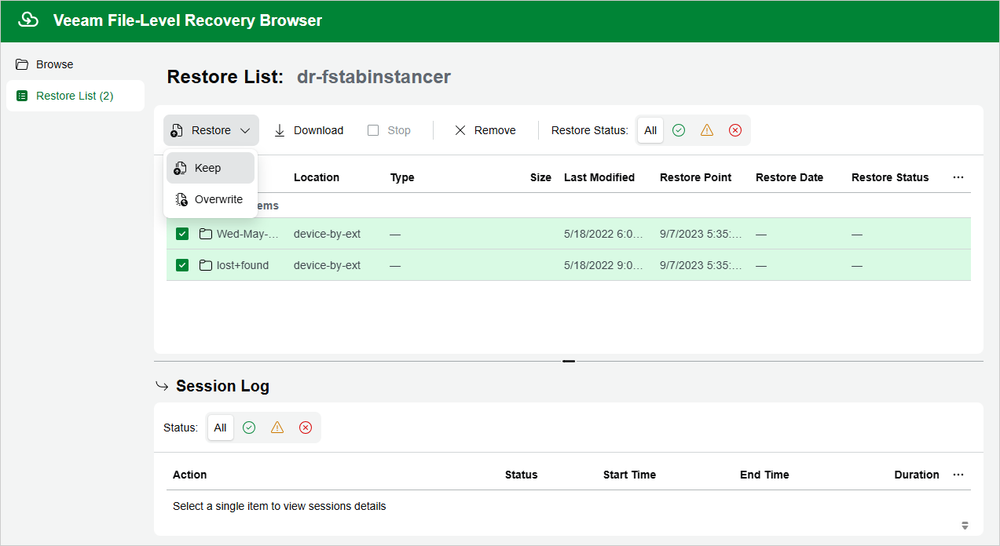

In this article

In the file-level recovery browser, you can find and recover items (files and folders) of the selected VM instance:

1. In the file-level recovery browser, navigate to a folder that contains the necessary files.
2. In the working area, select check boxes next to the files and click Add to Restore List.
3. Repeat steps 1–2 for all other folders whose files you want to recover.
4. Switch to the Restore List tab.
5. On the Restore List tab, review the list of items to recover, select check boxes next to the items and do the following:

* To save all the recovered items as a single .ZIP archive to the default download directory on a machine from which you access the browser, click Download.
* To recover the items to the original location, click Restore.

|  |
| --- |
| Note |
| When recovering items to the original location, Veeam Backup for Google Cloud will be able to display the directory structure only in case the disks of the source VM were mounted either using drive letters (for Windows-based VMs) or using UUIDs/labels with mount records stored in the /etc/fstab file (for Lunix-based VMs). If Veeam Backup for Google Cloud fails to display the structure correctly, you will be prompted to manually provide a path to the items you want to recover. |

Page updated 11/13/2025

Page content applies to build 7.0.0.47
