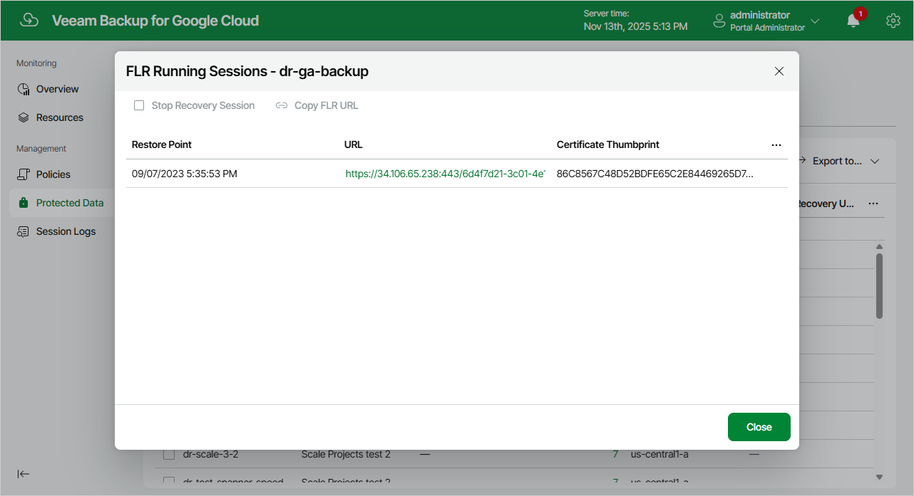

In this article

At the Summary step of the wizard, review summary information and click Finish.

As soon as you click Finish, Veeam Backup for Google Cloud will close the File-level Recovery wizard, start a recovery session and display the FLR Running Sessions window. During the recovery session, Veeam Backup for Google Cloud will deploy a worker instance and attach persistent disks of the processed VM instance to it.

|  |
| --- |
| Tip |
| If you accidentally close the FLR Running Sessions window, navigate to Protected Data and click the link in the File-Level Recovery URL column to open the window again. |

In the FLR Running Sessions window, you can track the state of the recovery session. In the URL column of the window, Veeam Backup for Google Cloud will display a link to the file-level recovery browser. You can use the link in either of the following ways:

* Click the link to open the file-level recovery browser on your local machine while the recovery session is running.
* Copy the link, close the FLR Running Sessions window and open the file-level recovery browser on another machine.

|  |
| --- |
| Important |
| When you click Copy FLR URL, Veeam Backup for Google Cloud copies the following information to the clipboard:   * A link to the file-level recovery browser that includes an IP address of the worker instance hosting the browser and authentication information used to access the browser. * A thumbprint of a TLS certificate that is installed on the worker instance hosting the file-level recovery browser.   To avoid a man-in-the-middle attack, before you start recovering files and folders, check that the certificate thumbprint displayed in the web browser from which you access the file-level recovery browser matches the provided certificate thumbprint. |

Page updated 11/13/2025

Page content applies to build 7.0.0.47
