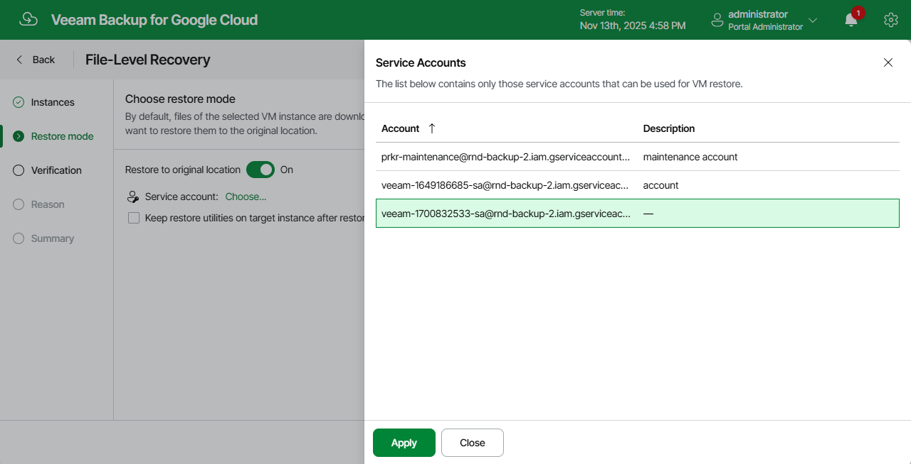

In this article

At the Restore Mode step of the wizard, choose whether you want to download files and folders to a local machine or restore them to the original location. If you set the Restore to original location toggle to On, you must also specify a service account that has all the permissions required to perform the restore operation. For more information on the required permissions, see [Service Account Permissions](restore_permissions.md#vm).

For a service account to be displayed in the Service account drop-down list, it must be added to Veeam Backup for Google Cloud as described in section [Adding Service Accounts](adding_service_accounts.md), and must be assigned the VM Instances Restore and File-level Recovery to Original Location operational roles as described in section [Adding Projects and Folders](adding_projects.md). If you have not added the necessary service account to Veeam Backup for Google Cloud beforehand, you can do it without closing the VM Instance Restore wizard. To do that, click Add and complete the Add Service Account wizard.

|  |
| --- |
| Important |
| * Real-time protection (for example, Microsoft Defender antivirus) enabled on the target instance may significantly decrease the speed of the recovery process. * You can specify the Compute Engine default service account to perform the restore operation. However, keep in mind that the account is assigned the Editor role with a wide scope of permissions by default. To learn now to disable the default behavior, see [Google Cloud documentation](https://cloud.google.com/compute/docs/access/service-accounts?&_ga=2.58087914.-1374893166.1657536691#default_service_account). |

If you choose to perform restore to the original location, the target instance must meet the following requirements:

* The instance must be powered on.
* If the instance is a Linux-based VM, it must allow SSH access, and Veeam Backup for Google Cloud must have root access over SSH. To learn how to allow SSH access, see [Google Cloud documentation](https://cloud.google.com/compute/docs/instances/ssh).

If the instance is a Windows-based VM, it must have Windows Remote Management (WinRM) configured. To learn how to configure WinRM, see [Microsoft documentation](https://learn.microsoft.com/en-us/windows/win32/winrm/installation-and-configuration-for-windows-remote-management).

* The instance must be configured to allow the Cloud Pub/Sub API access. To learn how to allow Pub/Sub API access, see [Google Cloud documentation](https://cloud.google.com/compute/docs/access/service-accounts).

* The instance network must have the following firewall rule to allow access by IAP tunnel: IP address range 35.235.240.0/20, ports 22 and 5986. To learn how to configure firewall rules, see [Google Cloud documentation](https://cloud.google.com/firewall/docs/firewalls#firewall-rules-in-google-cloud).

|  |
| --- |
| Tip |
| When Veeam Backup for Google Cloud performs restore to original location, it launches specific utilities on the target instance. If you plan to perform restore operations to the same instance in the future, you can select Keep restore utilities on target instance after restore check box to retain the utilities on the instance. This will allow Veeam Backup for Google Cloud to perform future restore operations faster. |

Page updated 12/8/2025

Page content applies to build 7.0.0.47
