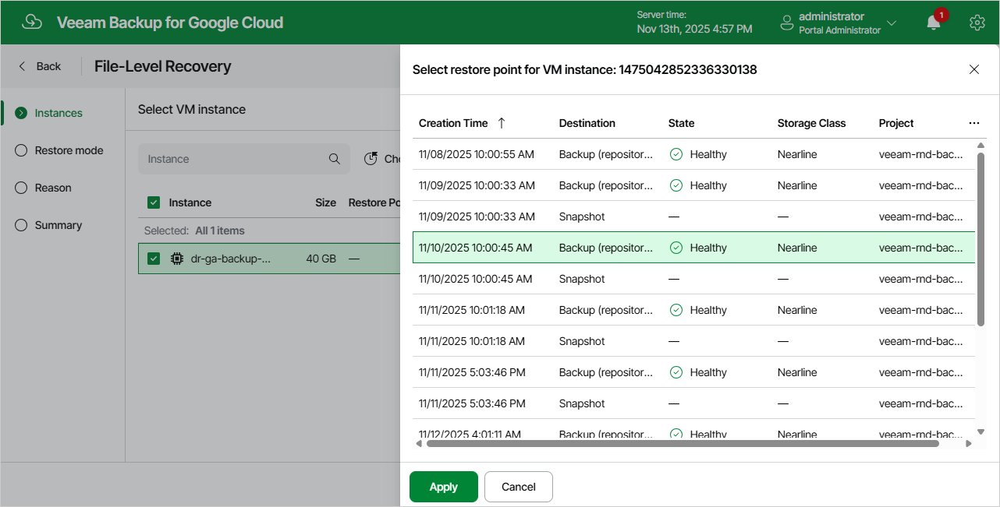

# Step 2. Select Restore Point

At the Instances step of the wizard, select a restore point that will be used to recover files and folders of the selected VM instance. By default, Veeam Backup for Google Cloud uses the most recent restore point. However, you can recover the items to an earlier state.

To select a restore point, do the following:

1. Select the VM instance.
2. Click Choose Restore Point.
3. In the Select restore point window, select the necessary restore point and click Apply.

To help you choose a restore point, Veeam Backup for Google Cloud provides the following information on each available restore point:

* Creation Time — the date when the restore point was created.
* Destination — the type of the restore point:

* Snapshot — a cloud-native snapshot created by a backup policy.
* Manual Snapshot — a cloud-native snapshot created manually.

* Backup — an image-level backup created by a backup policy.

* State — the result of the latest health check performed for the restore point.

* Storage Class — the storage class of a backup repository where the restore point is stored (applies only to image-level backups).
* Project — a project that manages the protected VM instance.
* Region — a region in which the protected VM instance resides.
* Retention — a retention configured for the backup policy that created the restore point.

