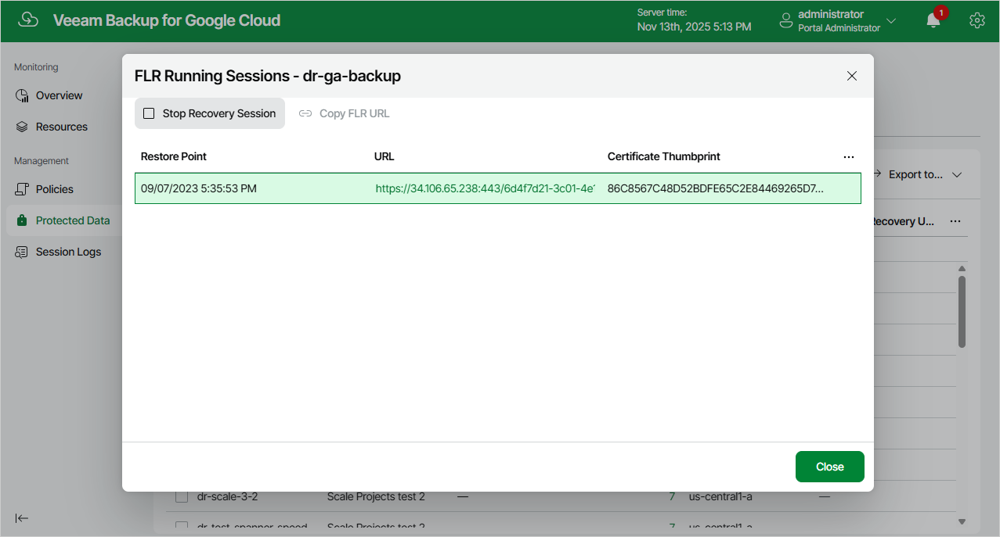

In this article

After you finish working with the file-level recovery browser, it is recommended that you stop the running recovery session so that Veeam Backup for Google Cloud can detach persistent disks of the processed VM instance from the deployed worker instance and remove the worker instance from Google Cloud.

To stop the recovery session, click Stop Recovery Session in the FLR Running Sessions window. If you do not perform any actions in the file-level recovery browser for 30 minutes, Veeam Backup for Google Cloud will stop the recovery session automatically.

|  |
| --- |
| Tip |
| If you accidentally close the FLR Running Sessions window, navigate to Protected Data and click the link in the File-Level Recovery URL column to open the window again. |

Page updated 11/13/2025

Page content applies to build 7.0.0.47
