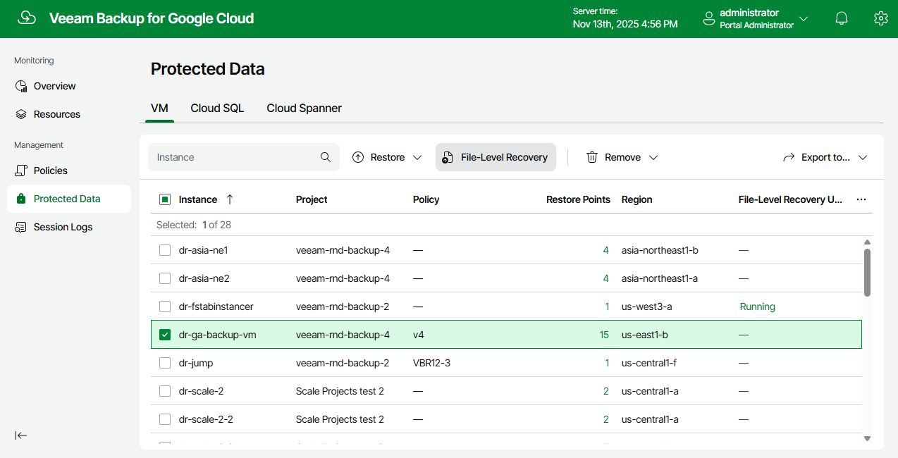

In this article

To launch the File-Level Recovery wizard, do the following:

1. Navigate to Protected Data > VM.
2. Select the VM instance whose files and folders you want to recover, and click File-Level Recovery.

Page updated 11/13/2025

Page content applies to build 7.0.0.47
