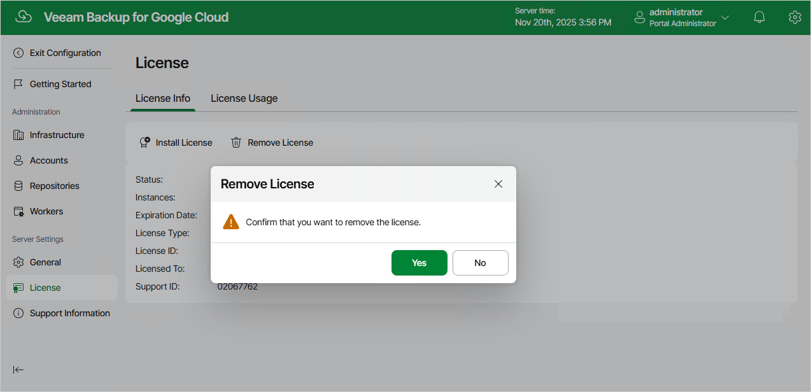

# Appendix B. Installing and Removing Backup Appliance License

To remove a license installed on the backup appliance if you no longer need it, do the following:

1. On the License Info tab, click Remove License.
2. In the Remove License window, click Yes to confirm that you want to remove the license.

After you remove the license, Veeam Backup for Google Cloud will automatically switch back to the Free edition. In this case, according to the FIFO (first-in first-out) queue, only the first 10 instances registered in the configuration database will remain protected. You can revoke license units from these instances as described in section [Revoking License Units](revoking_license_units.md).

Related Topics

[Viewing License Information](viewing_license_information.md)

