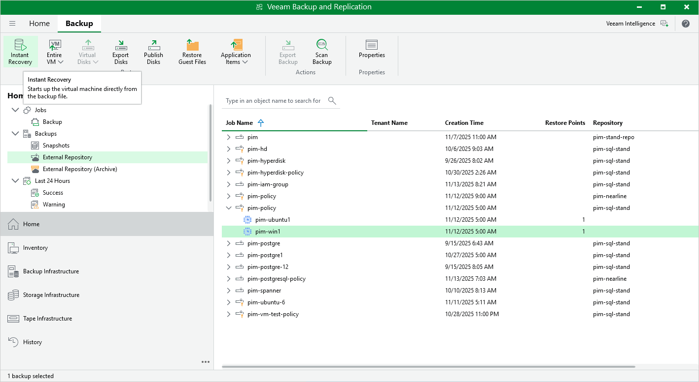

In this article

Veeam Backup & Replication allows you to use the Instant Recovery feature to restore VM instances from image-level backups to VMware vSphere and Microsoft Hyper-V environments, and to Nutanix AHV clusters. For more information, see the Veeam Backup & Replication User Guide, section [Instant Recovery](https://tw-preview.dev.amust.local/html/vbr/13.0.1/userguide/vm_recovery_all.html?ver=13).

|  |
| --- |
| Important |
| Instant Recovery can be performed only using backup files stored in backup repositories for which you have specified HMAC keys associated with the service accounts that are used to access the repositories. To learn how to specify credentials for repositories, see sections [Creating New Repositories](add_repo_service_account.md) and [Connecting to Existing Appliances](connect_appliance_repo.md). |

Before you start the recovery operation, make sure that you have added to the backup infrastructure a vCenter Server, a Microsoft Hyper-V server or a Nutanix AHV cluster that will manage the restored VM instances, as described in the Veeam Backup & Replication User Guide, section [Adding VMware vSphere Servers](https://helpcenter.veeam.com/docs/vbr/userguide/add_vmware_server.html?ver=13), [Adding Microsoft Hyper-V Servers](https://helpcenter.veeam.com/docs/vbr/userguide/add_hyperv_server.html?ver=13) or [Adding Nutanix AHV Cluster](https://helpcenter.veeam.com/docs/vbahv/userguide/add_ahv_cluster.html?ver=8).

To perform Instant Recovery, do the following:

1. In the Veeam Backup & Replication console, open the Home view.
2. Navigate to Backups > External Repository.
3. Expand the backup policy that protects a VM instance that you want to recover, select the necessary instance and click Instant Recovery on the ribbon.
4. Select VMware vSphere, Microsoft Hyper-V or Nutanix AHV.

1. Depending on the selected Instant Recovery option, complete the Instant Recovery wizard as described in the Veeam Backup & Replication User Guide, section [Performing Instant Recovery of Workloads to VMware vSphere VMs](https://helpcenter.veeam.com/docs/vbr/userguide/instant_recovery_vms_vm.html?ver=13), [Performing Instant Recovery of Workloads to Hyper-V VMs](https://helpcenter.veeam.com/docs/vbr/userguide/ir_workloads_hv.html?ver=13) or [Performing Instant Recovery of Workloads to Nutanix AHV](https://helpcenter.veeam.com/docs/vbahv/userguide/ir_workloads_ahv.html?ver=8).

Page updated 11/18/2025

Page content applies to build 7.0.0.47
