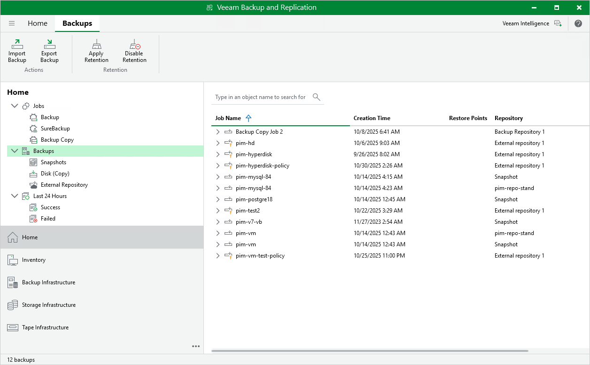
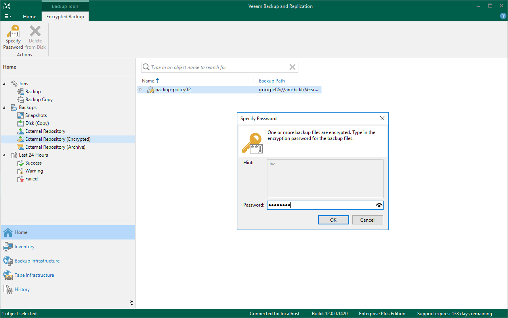

In this article

To view and manage backed-up data, navigate to the Backups node of the Home view. The node displays information on all restore points created by backup appliances.

|  |
| --- |
| Note |
| You cannot remove created image-level backups and snapshots from the Veeam Backup & Replication console. To remove restore points of VM, Cloud SQL and Cloud Spanner instances, [open the Veeam Backup for Google Cloud Web UI](accessing_vb_console.md) and follow the instructions provided in section [Removing Backups and Snapshots](managing_data_ui.md#removing). |

When you expand the Backups node in the working area, you can see the following icons:

| Icon | Protected Workload |
| --- | --- |
|  | Indicates that the protected workload is a VM instance. |
|  | Indicates that the protected workload is a Cloud SQL instance. |
|  | Indicates that the protected workload is a Cloud Spanner instance. |

The Backups node contains subnodes, such as:

* The Snapshots subnode displays information on cloud-native snapshots of the protected VM, Cloud SQL and Cloud Spanner instances:

* <appliance\_name> nodes show snapshots created manually on backup appliances and snapshots imported to the appliances from Google Cloud regions specified in backup policy settings.
* <backup\_policy\_name> nodes show snapshots created by backup policies.

To learn how Veeam Backup for Google Cloud creates cloud-native snapshots, see [VM Snapshot Chain](snapshot_chain_vm.md), [Cloud SQL Snapshot Chain](snapshot_chain_sql.md) and [Cloud Spanner Snapshot Chain](snapshot_chain_spanner.md).

* The External Repository subnode displays information on image-level backups of the protected VM, Cloud SQL and Cloud Spanner instances that are stored in standard repositories.

To learn how Veeam Backup for Google Cloud creates image-level backups, see [VM Backup Chain](backup_chain_vm.md), [Cloud SQL Backup Chain](backup_chain_sql.md) and [Cloud Spanner Backup Chain](backup_chain_vm.md).

|  |
| --- |
| Note |
| If a backup chain was originally encrypted and then got decrypted by Veeam Backup & Replication, the backup chain will be marked with the Key icon. |

* The External Repository (Encrypted) subnode displays information on encrypted image-level backups of the protected VM, Cloud SQL and Cloud Spanner instances that are stored in standard repositories and that have not been decrypted yet, which means either that you have not specified the decryption password or that the specified password is invalid.

To learn how to decrypt backups, see [Decrypting Backups](#decrypt).

* The External Repository (Archive) subnode displays information on image-level backups of the protected VM, Cloud SQL and Cloud Spanner instances that are stored in archive repositories.

To learn how Veeam Backup for Google Cloud creates archive backups, see [VM Archive Backup Chain](archive_backup_chain_vm.md), [Cloud SQL Archive Backup Chain](archive_backup_chain_sql.md) and [Cloud Spanner Archive Backup Chain](archive_backup_chain_spanner.md).

Decrypting Backups

Veeam Backup & Replication automatically decrypts backup files stored in repositories using passwords that you specify when [adding these repositories](connect_appliance_repo.md) to the backup infrastructure. If you do not specify decryption passwords, the backup files remain encrypted.

To decrypt backup files, do the following:

1. In the Veeam Backup & Replication console, open the Home view.
2. Navigate to Backups > External Repository (Encrypted).
3. Expand the backup policy that protects a VM instance whose image-level backups you want to decrypt, and select the backup chain that belongs to the instance. Click Specify Password on the ribbon.

Alternatively, you can right-click the necessary backup chain and select Specify password.

|  |
| --- |
| Tip |
| To decrypt all backups created by the policy, right-click the backup policy and select Specify Password. |

1. In the Specify Password window, enter the password that was used to encrypt the data stored in the target repository.

Page updated 11/21/2025

Page content applies to build 7.0.0.47
