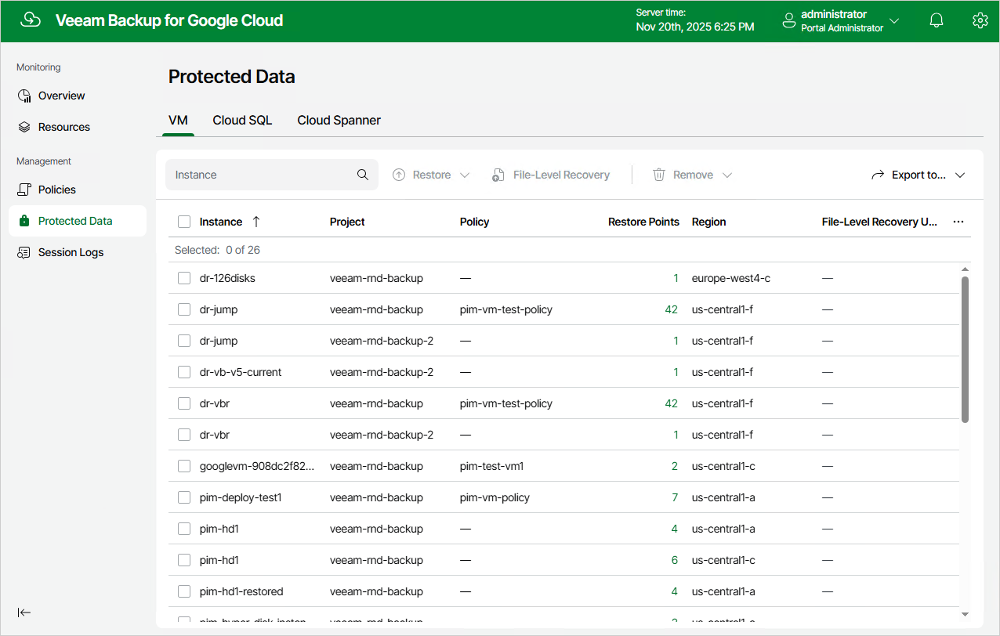
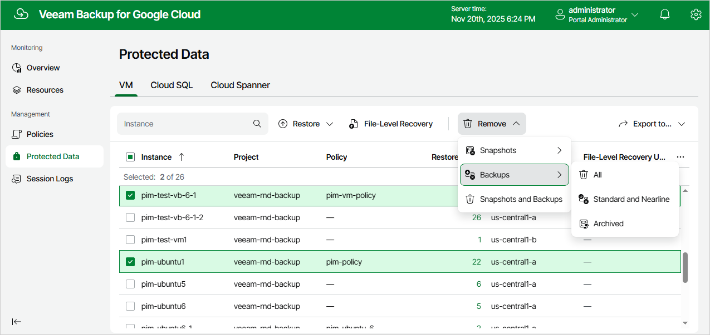

In this article

After a backup policy successfully creates a restore point for a Google Cloud resource, or after you create a snapshot of a resource manually using Veeam Backup for Google Cloud, the resource is automatically added to the resource list on the Protected Data page.

For each backed-up Google Cloud resource, Veeam Backup for Google Cloud creates a record in the configuration database with a set of properties, such as:

* Instance — the name of the resource.
* Policy — the name of the backup policy that protects the resource.
* Restore Points — the number of restore points created for the resource.
* Latest Restore Point — the date and time of the most recent restore point created for the resource.
* Region — the region in which the resource resides.
* Configuration — the instance configuration that defines the geographic location where the Cloud Spanner instance data is stored.
* Engine — the database engine and version installed on the Cloud SQL instance.
* Operating System — the operating system running on the VM instance.
* File-level Recovery URL — the link to the file-level recovery browser.

The link appears when Veeam Backup for Google Cloud starts a restore session to perform [file-level recovery](performing_flr.md). The link contains a public DNS name of the worker instance hosting the file-level recovery browser and authentication information used to access this worker instance.

On the Protected Data page, you can perform the following actions:

* Remove restore points if you no longer need them. For more information, see [Removing Backups and Snapshots](#removing).
* Restore data of backed-up VM, Cloud SQL and Cloud Spanner instances. For more information, see sections [Performing VM Restore](vm_restore.md), [Performing SQL Restore](sql_restore.md) and [Performing Spanner Restore](spanner_restore.md).

Removing Backups and Snapshots

Veeam Backup for Google Cloud stores information on all protected Google Cloud resources in the configuration database. Even if a resource is no longer protected by any backup policy, information on the backed-up data will not be deleted from the database until Veeam Backup for Google Cloud automatically removes all restore points associated with this resource according to the retention settings saved in the backup metadata. If necessary, you can also remove the restore points manually.

|  |
| --- |
| Important |
| Do not delete backups from Google Cloud storage buckets in the Google Cloud console. If some backup in a backup chain is missing, you will not be able to roll back the resource data to the necessary state. |

To remove restore points manually, do the following:

1. Navigate to Protected Data.
2. Switch to the necessary tab and select resources whose restore points you want to remove.
3. Click Remove and select either of the following options:

* Snapshots > All — to remove all cloud-native snapshots created for the selected resources both by backup policies and manually.
* Snapshots > Created by Policy — to remove all cloud-native snapshots created for the selected resources by backup policies.
* Snapshots > Created Manually — to remove all cloud-native snapshots created for the selected resources manually.
* Backups > All — to remove all image-level backups created for the selected resources.
* Backups > Standard and Nearline — to remove all image-level backups created for the selected resources in backup repositories of the Standard and Nearline storage classes.
* Backups > Archived — to remove all image-level backups created for the selected resources in backup repositories of the Archive storage class.
* Snapshots and Backups — to remove both cloud-native snapshots and image-level backups created for the selected resources.

|  |
| --- |
| Tip |
| Cloud Spanner snapshots will be retained in Google Cloud Storage for up to one year only, regardless of the policy settings. However, the retention time for regular backups and archived backups stored in Veeam repositories is not limited. |

Page updated 11/20/2025

Page content applies to build 7.0.0.47
