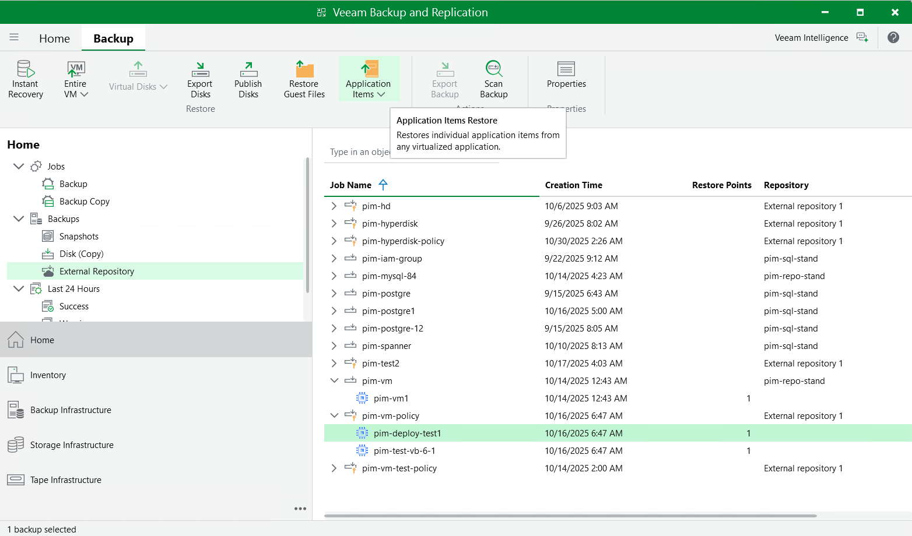

In this article

Veeam Backup & Replication provides auxiliary tools — Veeam Explorers — that allow you to restore application items directly from image-level backups of VM instances. You can restore items of the following applications: Microsoft Entra ID, Microsoft Exchange, Microsoft SharePoint, Microsoft SQL Server and Oracle Database. For more information, see the [Veeam Explorers User Guide](https://helpcenter.veeam.com/docs/backup/explorers/explorers_introduction.html?ver=120).

|  |
| --- |
| Important |
| Application restore can be performed only using backup files stored in backup repositories for which you have specified HMAC keys associated with the service accounts that are used to access the repositories. To learn how to specify credentials for repositories, see sections [Creating New Repositories](add_repo_service_account.md) and [Connecting to Existing Appliances](connect_appliance_repo.md). |

To perform application restore, do the following:

1. In the Veeam Backup & Replication console, open the Home view.
2. Navigate to Backups > External Repository.
3. Expand the backup policy that protects a VM instance whose application item you want to restore, select the necessary instance and click Application Items on the ribbon. Then, select the necessary application.
4. In the restore wizard, select a restore point that will be used to restore the application, specify a restore reason and click Browse.
5. In the Veeam Explorer application, perform the steps described in the [Veeam Explorers User Guide](https://helpcenter.veeam.com/docs/backup/explorers/explorers_introduction.html?ver=120).

Page updated 11/13/2025

Page content applies to build 7.0.0.47
