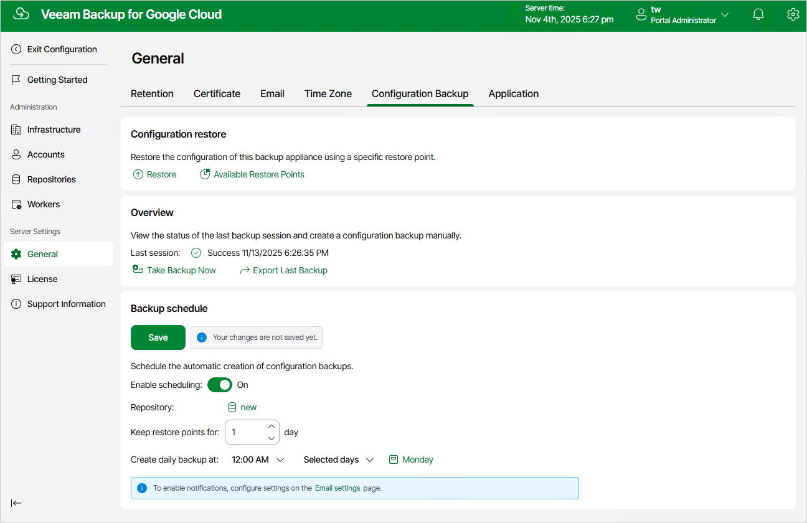

# Performing Configuration Backup Using Web UI

While performing configuration backup, Veeam Backup for Google Cloud exports data from the configuration database and saves it to a backup file in a backup repository. You can back up the configuration database of a backup appliance either manually or automatically.

|  |
| --- |
| Important |
| If your backup appliance is managed by a Veeam Backup & Replication server, you will neither be able to perform manual or scheduled configuration backup of Veeam Backup for Google Cloud from the Web UI, nor to export the configuration data from the Web UI. In this case, you can perform configuration backup using the Veeam Backup & Replication console as described in section [Performing Configuration Backup Using Console](performing_configuration_backup_console.md). |

Performing Configuration Backup Manually

To back up the configuration database manually, do the following:

1. Switch to the Configuration page.
2. Navigate to General > Configuration Backup.
3. In the Overview section, click Take Backup Now.
4. In the Create Manual Backup window, select a repository where the configuration backup will be stored, and click Create.

For a backup repository to be displayed in the Repository list, it must be added to Veeam Backup for Google Cloud as described in section [Adding Backup Repositories](adding_repositories.md). The Repository list shows only backup repositories of the Standard and Nearline storage classes that have encryption enabled.

As soon as you click Create, Veeam Backup for Google Cloud will start creating a new backup file in the selected repository. To track the progress, click Go to Sessions in the Session Info window to proceed to the [Session Logs page](viewing_session_statistics.md).

|  |
| --- |
| Tip |
| Once Veeam Backup for Google Cloud creates a successful configuration backup, you can click Export Last Backup to download the backup file and then use it to [restore configuration data](performing_configuration_restore_ui.md). |

Performing Configuration Backup Automatically

To instruct Veeam Backup for Google Cloud to back up the configuration database automatically by schedule, do the following:

1. Switch to the Configuration page.
2. Navigate to General > Configuration Backup.
3. In the Backup schedule section, set the Enable scheduling toggle to On.
4. Click Choose in the Repository field, and use the list of available repositories in the Choose Repository window to select a repository where configuration backups will be stored.

For a backup repository to be displayed in the list of available repositories, it must be added to Veeam Backup for Google Cloud as described in section [Adding Backup Repositories](adding_repositories.md). The list shows only backup repositories of the Standard and Nearline storage classes that have encryption enabled.

1. In the Keep restore points for field, specify the number of days for which you want to keep restore points in the selected backup repository.
2. In the Create daily backup at field, choose whether configuration backups will be created every day, on weekdays (Monday through Friday), or on specific days.
3. Click Save.

