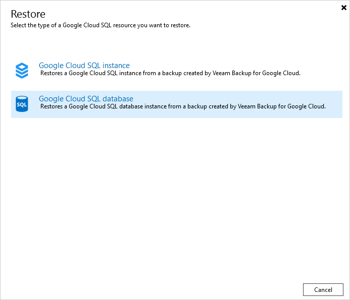

# Performing Database Restore

In case a disaster strikes, you can restore corrupted databases of Cloud SQL instance from an image-level backup. Veeam Backup & Replication allows you to restore databases to the original location or to a new location.

To restore a database, do the following:

1. In the Veeam Backup & Replication console, open the Home view.
2. Navigate to Backups.
3. Expand the backup policy that protects a Cloud SQL instance whose database you want to restore, select the necessary instance and click Google Cloud SQL on the ribbon.

Alternatively, you can right-click the Cloud SQL instance and select Restore to Google SQL.

1. In the Restore window, select Google Cloud SQL database.

Veeam Backup & Replication will open the Data Restore wizard in a web browser. Complete the wizard as described in section [Performing Database Restore](database_restore_point.md).

