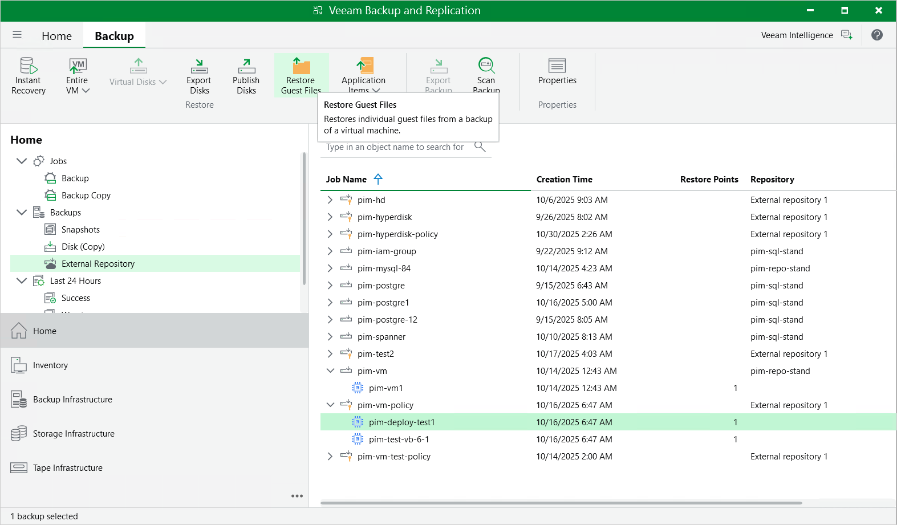

# Performing Guest OS File Recovery

Veeam Backup & Replication allows you to use image-level backups to restore files and folders of various VM guest OS file systems from the Veeam Backup & Replication console. For more information, see the Veeam Backup & Replication User Guide, section [Guest OS File Recovery](https://helpcenter.veeam.com/docs/vbr/userguide/guest_file_recovery.html?ver=13).

|  |
| --- |
| Important |
| Guest OS file recovery can be performed only using backup files stored in backup repositories for which you have specified HMAC keys associated with the service accounts that are used to access the repositories. To learn how to specify credentials for repositories, see sections [Creating New Repositories](add_repo_service_account.md) and [Connecting to Existing Appliances](connect_appliance_repo.md). |

You can also perform file-level recovery using the Veeam Backup for Google Cloud Web UI. For more information, see [Performing File-Level Recovery](performing_flr.md).

Restoring Files of Microsoft Windows File Systems (FAT, NTFS or ReFS)

Before you start the restore operation, check the limitations and prerequisites described in the Veeam Backup & Replication User Guide, section [Considerations and Limitations](https://helpcenter.veeam.com/docs/vbr/userguide/vbr_flr_considerations_common.html?ver=13).

To restore guest OS files and folders, do the following:

1. In the Veeam Backup & Replication console, open the Home view.
2. Navigate to Backups > External Repository.
3. Expand the backup policy that protects a VM instance whose files and folders you want to restore, select the necessary instance and click Guest Files (Windows) on the ribbon.

1. Complete the File Level Restore wizard as described in the Veeam Backup & Replication User Guide, section [Restoring VM Guest OS Files (FAT, NTFS or ReFS)](https://helpcenter.veeam.com/docs/vbr/userguide/guest_file_recovery.html?ver=13).

Restoring Files of Linux, Unix and Other Supported File Systems

|  |
| --- |
| Note |
| You can restore files of Linux, Solaris, BSD, Novell Storage Services, Unix and Mac machines. For the list of supported file systems, see the Veeam Backup & Replication User Guide, section [Platform Support](https://helpcenter.veeam.com/docs/vbr/userguide/workloads.html?ver=13). |

Before you start the restore operation, check the limitations and prerequisites described in the Veeam Backup & Replication User Guide, section [Considerations and Limitations](https://helpcenter.veeam.com/docs/vbr/userguide/data_recovery_all.html?ver=13).

To restore guest OS files and folders, do the following:

1. In the Veeam Backup & Replication console, open the Home view.
2. Navigate to Backups > External Repository.
3. Expand the backup policy that protects a VM instance whose files and folders you want to restore, select the necessary instance and click Restore Guest Files on the ribbon.
4. Complete the Guest File Restore wizard as described in the Veeam Backup & Replication User Guide, section [Restoring VM Guest OS Files (Multi-OS)](https://helpcenter.veeam.com/docs/backup/vsphere/multios_restore_intro.html?ver=120).

|  |
| --- |
| Tip |
| If the file system whose files and folders you want to restore is not included in the list of supported systems, do either of the following:   * Perform restore to the VMware vSphere environment using the Instant Disk Recovery technology. For more information, see the Veeam Backup & Replication User Guide, section [Restore from Other File Systems](https://tw-preview.dev.amust.local/html/vbr/13.0.1/userguide/item_recovery.html?ver=13). * Perform restore to the Microsoft Hyper-V environment using the Instant Recovery technology. For more information, see the Veeam Backup & Replication User Guide, section [Restore from Other File Systems](https://tw-preview.dev.amust.local/html/vbr/13.0.1/userguide/item_recovery_hv.html?ver=13). |

