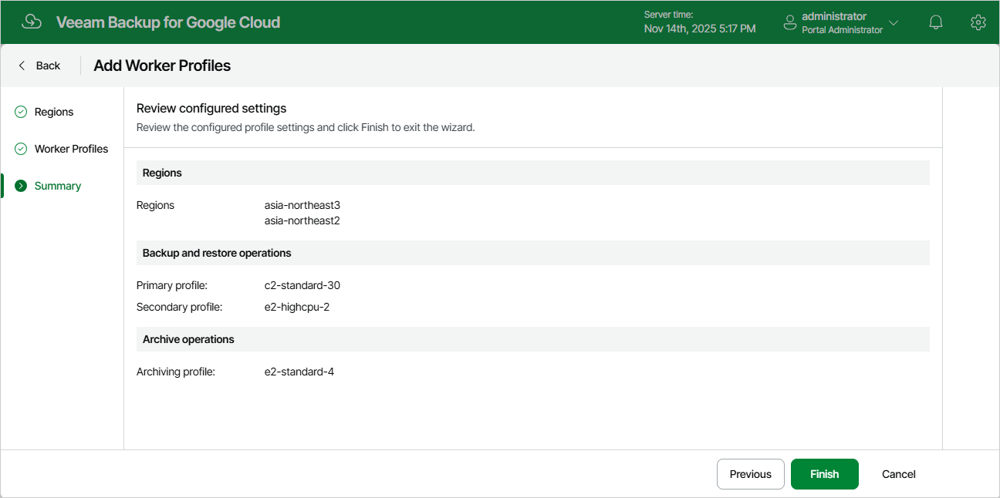

# Step 4. Finish Working with Wizard

At the Summary step of the wizard, review summary information and click Finish.

As soon as you click Finish, Veeam Backup for Google Cloud will create a separate set of worker profiles for each of the selected regions.

