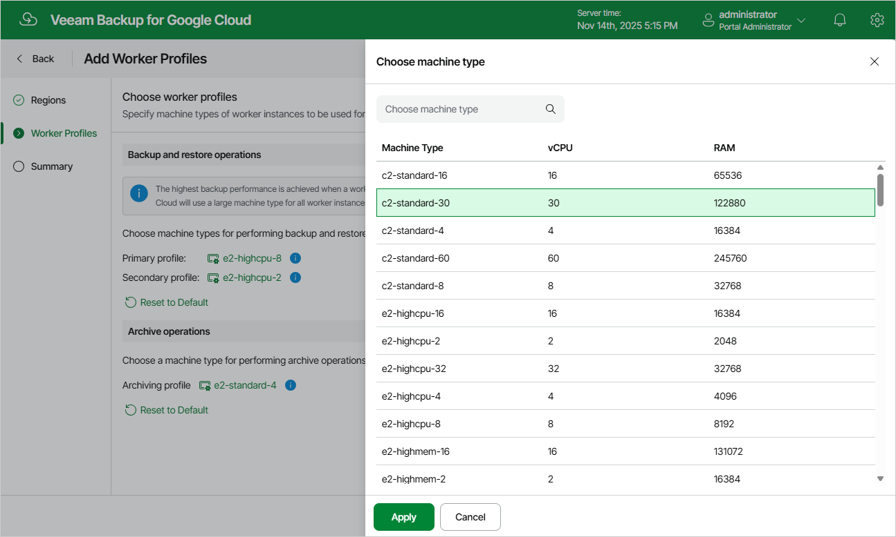

In this article

At the Worker Profiles step of the wizard, choose profiles that will be used to deploy workers in the selected regions. To help you choose, tables in the Choose machine type sections will provide information on the number of vCPU cores and the amount of system RAM for each available machine type.

|  |
| --- |
| Important |
| Due to technical limitations, the list of available machine types is automatically filtered to show:   * For the primary profile, only those machine types that allow mounting persistent disks with at least 4 TB of total disk space attached. * For the archiving profile, only those machine types that come with at least 8 GB RAM. |

For the full description of machine types that can be used to deploy VM instances in Google Cloud, see [Google Cloud documentation](https://cloud.google.com/compute/docs/machine-types).

Related Topics

[Sizing and Scalability Guidelines](worker_recommendations.md)

Page updated 11/14/2025

Page content applies to build 7.0.0.47
