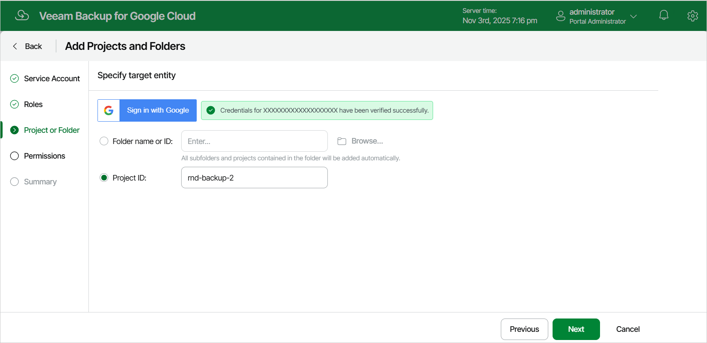

# Step 4. Specify Project or Folder

At the Project or Folder step of the wizard, specify the ID of a project or folder that manages the resources that you want to protect. If you choose a folder, Veeam Backup for Google Cloud will be able to access all resources in all projects that reside in this folder.

You can find the project and folder IDs on the Dashboard page in the Google Cloud console. For more information, see [Google Cloud documentation](https://cloud.google.com/resource-manager/docs/creating-managing-projects#identifying_projects).

To help you choose a folder, Veeam Backup for Google Cloud provides information on the Google Cloud resource hierarchy in your organization. However, this option is available for authorized users only. To authorize in Google Cloud and to display the hierarchy, do the following:

1. Click Sign in with Google.

For Veeam Backup for Google Cloud to be able to authorize in Google Cloud, the OAuth consent screen must be configured as described in section [Registering Applications](registering_applications.md).

1. Specify credentials of a Google account with the Organization Viewer and Folder Viewer roles assigned.

Note that Veeam Backup for Google Cloud does not store in the configuration database the provided Google account credentials and access tokens received during authorization.

|  |
| --- |
| Important |
| Before you proceed, make sure that the Google account whose credentials you use for authorization has the following permissions assigned at the organization level: resourcemanager.folders.get, resourcemanager.organizations.get, resourcemanager.projects.get. Otherwise, Veeam Backup for Google Cloud will fail to locate the folder. |

1. Click Browse.

