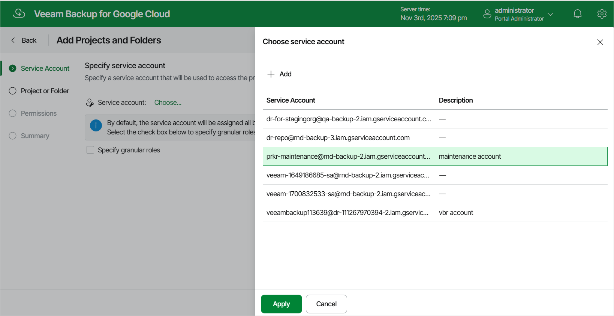

# Step 2. Specify Service Account

At the Service Account step of the wizard, specify a service account that Veeam Backup for Google Cloud will use to access the project or folder, and choose whether you want to define operations that Veeam Backup for Google Cloud will be able to perform with resources managed by the project or folder.

|  |
| --- |
| Note |
| If you choose not to define the available operations, the specified service account will be assigned a wide scope of permissions required to perform all data protection operations in the selected project or folder. |

To specify a service account, click the link in the Service account field. For a service account to be displayed in the list of available accounts, it must be added to Veeam Backup for Google Cloud as described in section [Adding Service Accounts](adding_service_accounts.md). If you have not added the necessary service account to Veeam Backup for Google Cloud beforehand, you can do it without closing the Add Projects and Folders wizard. To do that, click Add and complete the Add Service Account wizard.

