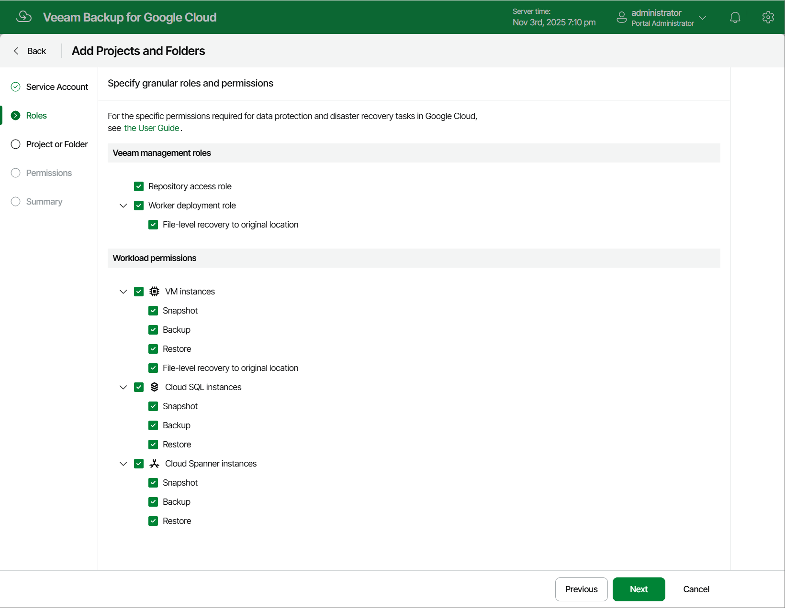

In this article

[This step applies only if you have selected the Specify granular roles check box at the Service Account step of the wizard]

At the Roles step of the wizard, define operations that Veeam Backup for Google Cloud will be able to perform for the resources managed by the project or folder: choose whether Veeam Backup for Google Cloud will be able to protect VM, Cloud SQL and Cloud Spanner instances that belong to this project or folder using cloud-native snapshots and image-level backups, to deploy backup repositories and workers in the project or folder, and to restore VM and Cloud SQL and Cloud Spanner instances to this project or folder from the created backups and snapshots.

In the Veeam management roles section, choose a type of the account role:

* Repository access role — permissions of this account role will be used to create new repositories in target Google Cloud buckets and further to access the repositories during data protection and disaster recovery operations. If you create an account role of this type, you will be able to select it [when configuring repository settings](repository_account.md).
* Worker deployment role — permissions of this account role will be used to deploy worker instances in the worker project. If you create a role of this type, you will be able to select it [when adding worker configurations](worker_project.md).
* File-level recovery to original location — permissions of this account role will be used to deploy worker instances during file-level recovery operations. If you create a role of this type, you will be able to select it when performing file-level restore.

In the Workload permissions section, choose workloads that will be protected using permissions of the account role, and operations that will be performed with these workloads:

* If you select the Backup and Snapshot operations, you will be able to specify the service account when performing [VM backup](backup_policy_project.md), [SQL backup](sql_policy_project.md) and [Spanner backup](spanner_policy_project.md).
* If you select the Restore operation, you will be able to specify the service account when performing [entire VM instance restore](vm_restore_service_account.md), [disk-level restore](disk_restore_service_account.md), [entire SQL instance restore](sql_restore_service_account.md), [SQL database restore](database_restore_project.md), [entire Spanner instance restore](spanner_restore_service_account.md) and [Spanner database restore](spanner_database_restore_project.md).
* If you select the File-level recovery to original location operation, you will be able to specify the service account when performing [file-level recovery to the original location](flr_restore_mode.md).

|  |
| --- |
| Important |
| Keep in mind that the specified options apply only to the role selection for restore operations — they do not grant any permissions (unless you have selected the Create new account option at [step 2](service_account_type.md) of the Adding Service Account wizard). That is why it is recommended that you check whether the added service account has all the permissions required to perform operations with the selected workloads. |

Page updated 11/14/2025

Page content applies to build 7.0.0.47
