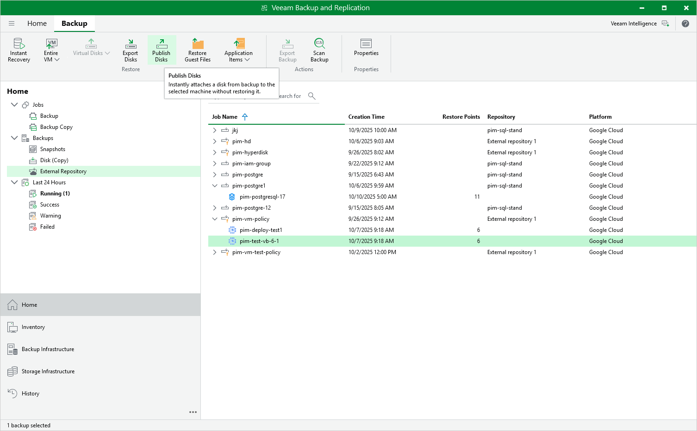

In this article

Veeam Backup & Replication allows you to publish point-in-time disks, that is, to mount specific disks of backed-up VM instances to any server to instantly access data in the read-only mode. You can copy the necessary files and folders to the target server, and perform an antivirus scan of the backed-up data. For more information, see the Veeam Backup & Replication User Guide, section [Disk Publishing (Data Integration API)](https://helpcenter.veeam.com/docs/vbr/userguide/data_integration_api.html?ver=13).

|  |
| --- |
| Important |
| Disk publishing can be performed only using backup files stored in backup repositories for which you have specified HMAC keys associated with the service accounts that are used to access the repositories. To learn how to specify credentials for repositories, see sections [Creating New Repositories](add_repo_service_account.md) and [Connecting to Existing Appliances](connect_appliance_repo.md). |

To publish disks of a VM instance, do the following:

1. In the Veeam Backup & Replication console, open the Home view.
2. Navigate to Backups > External Repository.
3. Expand the necessary backup policy, select the VM instance whose disks you want to publish and click Publish Disks on the ribbon.
4. Complete the Publish Disks wizard as described in the Veeam Backup & Replication User Guide, section [Publishing Disks](https://helpcenter.veeam.com/docs/vbr/userguide/publishing_disks.html?ver=13).

Page updated 11/18/2025

Page content applies to build 7.0.0.47
