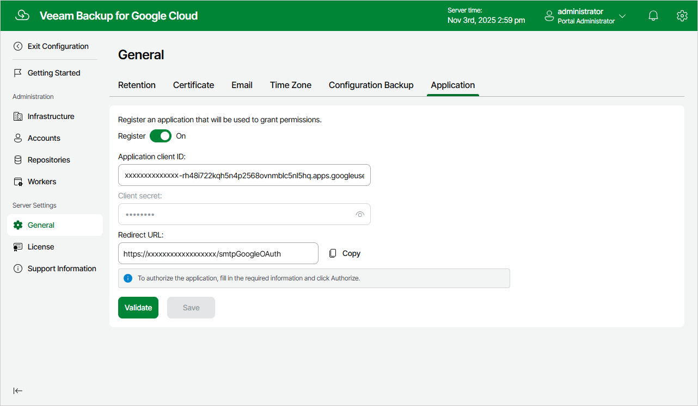

In this article

To allow Veeam Backup for Google Cloud to perform data protection and disaster recovery operations for resources in Google Cloud projects and folders, service accounts associated with the projects and folders must have specific permissions required to access these resources. If any of the permissions listed in section [Planning and Preparation](permissions.md) are missing for a service account, you can grant them in the Google Cloud console automatically, without leaving the Veeam Backup for Google Cloud UI. However, since this functionality employs the OAuth 2.0 protocol to access Google Cloud APIs, you must do the following:

1. In the Google Cloud console, configure the OAuth consent screen as described in [Google Cloud documentation](https://developers.google.com/workspace/guides/configure-oauth-consent).

Consider that Veeam Backup for Google Cloud requires the https://www.googleapis.com/auth/cloud-platform scope to be identified for the application in the OAuth consent screen. For more information on OAuth 2.0 Scopes for Google APIs, see [Google Cloud documentation](https://developers.google.com/identity/protocols/oauth2/scopes).

1. Set up a DNS hostname for the VM instance running Veeam Backup for Google Cloud (for example, using [Cloud DNS](https://cloud.google.com/dns/docs/set-up-dns-records-domain-name)).

Due to Google Cloud limitations, the OAuth consent screen cannot use public IP addresses as redirect URIs for OAuth 2.0 authorization. For more information on redirect URI validation rules, see [Google Cloud documentation](https://developers.google.com/identity/protocols/oauth2/web-server#uri-validation).

1. Access the Veeam Backup for Google Cloud UI using the DNS hostname of the backup appliance, switch to the Configuration page, navigate to General > Application, set the Register toggle to On, and copy the address displayed in the Redirect URL field.

To learn how to access Veeam Backup for Google Cloud UI, see [Accessing Veeam Backup for Google Cloud](accessing_vb.md).

1. Back to the Google Cloud console, create OAuth client ID credentials as described in [Google Cloud documentation](https://developers.google.com/workspace/guides/create-credentials#oauth-client-id).

In the Authorized redirect URIs section of the Create OAuth client ID page, add the address copied from the Veeam Backup for Google Cloud UI.

1. Back to the Veeam Backup for Google Cloud UI, on the Application tab, provide the Client ID and Client secret used to authorize access to the configured OAuth consent screen, and then click Authorize.

You will be redirected to the OAuth consent screen authorization page. Sign in using a Google account to validate the configured settings.

Page updated 11/12/2025

Page content applies to build 7.0.0.47
