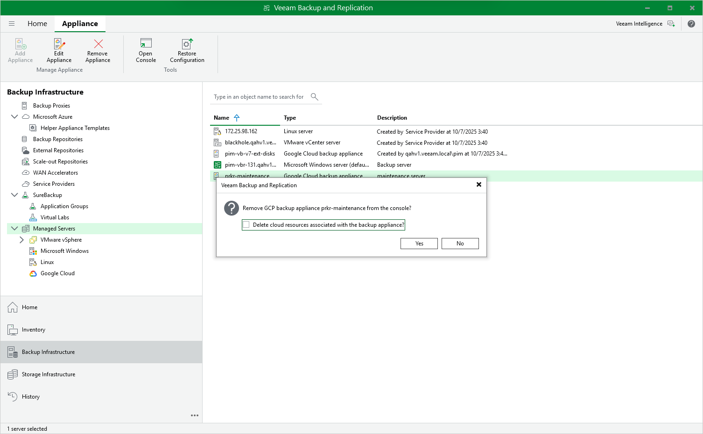

# Removing Appliances

Veeam Plug-in for Google Cloud allows you to permanently remove backup appliances from the backup infrastructure.

|  |
| --- |
| Note |
| After you remove a backup appliance, the following limitations will apply:   * Repositories for which you have not specified HMAC keys will be removed automatically from the backup infrastructure. * Repositories for which you have specified HMAC keys will remain in the backup infrastructure. However, you will have to rescan the repositories to collect information on all newly created and recently deleted (both manually and by retention) restore points.  * You will not be able to manage backup policies created on the appliance. * You will not be able to restore VM, Cloud SQL and Cloud Spanner instances from snapshots. * Restore to Google Cloud from image-level backups will start working as described in the Veeam Backup & Replication User Guide, section [How Restore to Google Compute Engine Works](https://helpcenter.veeam.com/docs/vbr/userguide/restore_google_hiw.html?ver=13).   Also, the restore process will start taking more time to complete causing data transfer costs to increase as Veeam Backup & Replication will not be able to use native Google Cloud capabilities and will have to process more data. |

To remove a backup appliance, do the following:

1. In the Veeam Backup & Replication console, open the Backup Infrastructure view.
2. Navigate to Managed Servers.
3. Select the necessary backup appliance and click Remove Appliance on the ribbon.

Alternatively, you can right-click the appliance and select Remove.

1. In the Veeam Backup & Replication window, do either of the following:

* If you want to remove the appliance from the backup infrastructure but leave it in Google Cloud, do not select the Delete cloud resources associated with the backup appliance? check box. Click Yes.

In this case, the appliance will continue creating restore points in its repositories according to configured backup policy settings, and you will still be able to use these restore points to perform restore from the Veeam Backup & Replication console. However, you will have to rescan the repositories every time you want to collect information on all newly created restore points, or to update the list of restore points that were removed manually or by retention.

* [Applies only to backup appliances version 3.0 or later] If you want to remove the appliance from both the backup infrastructure and the Google Cloud environment, select the Delete cloud resources associated with the backup appliance? check box. Then, click Yes.

In this case, Veeam Backup for Google Cloud will remove all resources associated with this appliance in Google Cloud.

