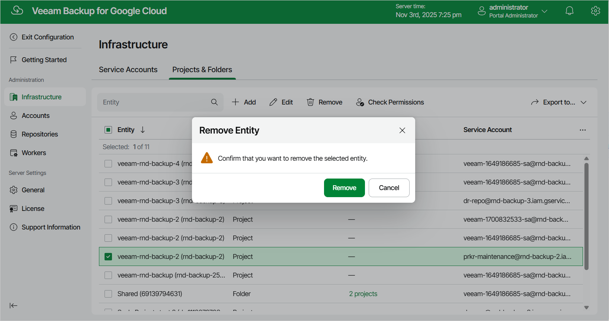

# Removing Projects and Folders

Veeam Backup for Google Cloud allows you to permanently remove a project or folder from the configuration database if you no longer need it:

1. Switch to the Configuration page.
2. Navigate to Infrastructure > Projects & Folders.
3. Select the project or folder and click Remove.

|  |
| --- |
| Note |
| You cannot remove a project or folder that is used by any backup policy, backup repository or worker configuration. [Disable and remove all the related policies](enabling_disabling_backup_policies.md), [remove all the related repositories](removing_repositories.md), [remove all the related worker configurations](removing_worker_configurations.md) — and then try removing the project again. |

