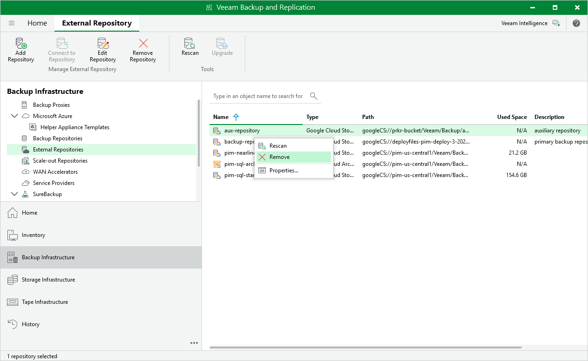
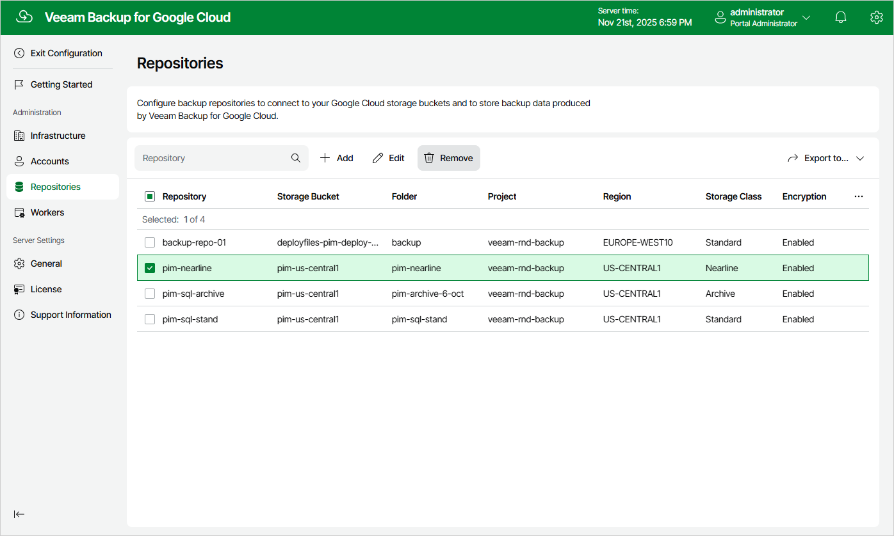

# Removing Backup Repositories

The consequences of actions performed with a backup repository depend on whether the repository has been added to the backup infrastructure using the Veeam Backup & Replication console or the Veeam Backup for Google Cloud Web UI.

Removing Backup Repositories Using Console

Veeam Plug-in for Google Cloud allows you to permanently remove repositories from the backup infrastructure:

1. In the Veeam Backup & Replication console, open the Backup Infrastructure view.
2. Navigate to External Repositories.
3. Select the necessary repository and click Remove Repository on the ribbon.

Alternatively, you can right-click the repository and select Remove.

|  |
| --- |
| Important |
| If you remove a backup repository using the Veeam Backup & Replication console, Veeam Backup & Replication will not propagate these settings to the backup appliance automatically. Consider removing the repository manually as described in section [Removing Backup Repositories Using Veeam Backup for Google Cloud Web UI](#remove_repo_from_web_ui). |

Removing Backup Repositories Using Web UI

The Veeam Backup for Google Cloud Web UI allows you to permanently remove backup repositories if you no longer need them. When you remove a backup repository, Veeam Backup for Google Cloud unassigns the repository role from the target storage bucket subdirectory so that the subdirectory is no longer used as a repository.

|  |
| --- |
| Note |
| Even though the storage bucket subdirectory is no longer used as a repository, Veeam Backup for Google Cloud preserves all backups previously stored in the repository and keeps these backups in Google Cloud Storage. You can assign the subdirectory to a new backup repository so that Veeam Backup for Google Cloud imports the backed-up data to the configuration database. In this case, you will be able to perform all disaster recovery operations described in section [Performing Restore](performing_restore.md).  If you no longer need the backed-up data, you can remove it as described in section [Removing Backups and Snapshots](managing_data_ui.md#removing). |

To remove a backup repository, do the following:

1. Switch to the Configuration page.
2. Navigate to Repositories.
3. Select the repository and click Remove.

|  |
| --- |
| Important |
| You cannot remove a backup repository that is used by any backup policy or by a scheduled configuration backup. [Modify the settings of all the related policies](enabling_disabling_backup_policies.md) to remove references to the repository, [change the configuration backup schedule](performing_configuration_backup_ui.md#config_backup_automatically) — and then try removing the repository again. |

