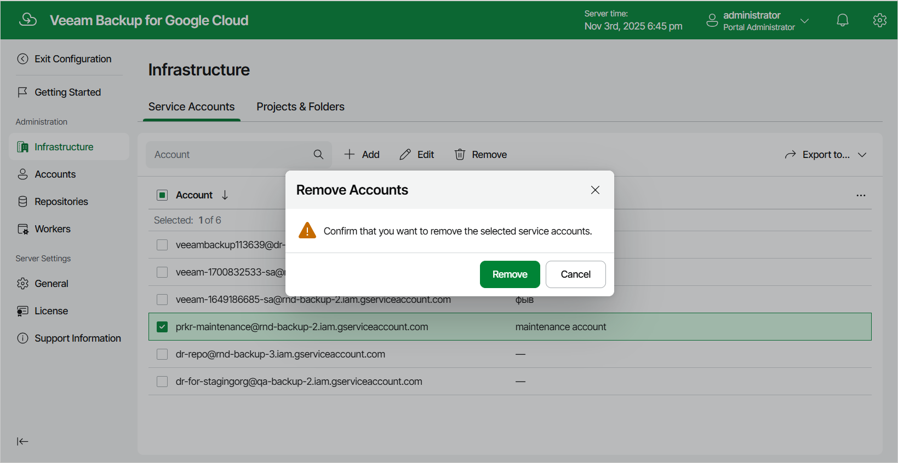

In this article

Veeam Backup for Google Cloud allows you to permanently remove a service account from the configuration database if you no longer need it:

1. Switch to the Configuration page.
2. Navigate to Infrastructure > Service Accounts.
3. Select the account and click Remove.

|  |
| --- |
| Note |
| You cannot remove a service account that is associated with any project or folder. [Remove all the related projects and folders](removing_projects.md) — and then try removing the account again. |

Page updated 11/14/2025

Page content applies to build 7.0.0.47
