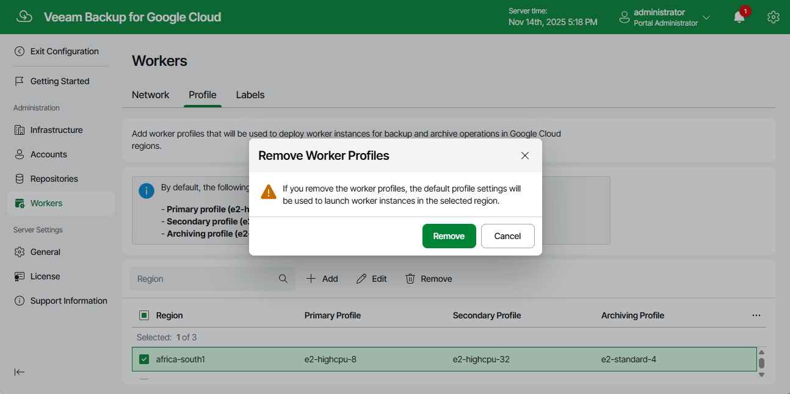

In this article

Veeam Backup for Google Cloud allows you to permanently remove sets of worker profiles if you no longer need them. When you remove a profile set, Veeam Backup for Google Cloud does not remove currently running worker instances that have been created based on this set — these instances are removed only when the related operations complete.

|  |
| --- |
| Note |
| After you remove a profile set, all worker instances that Veeam Backup for Google Cloud will further use to perform backup and archive operations in the region specified in the set will be deployed with the [default profiles](managing_worker_profiles.md). |

To remove a profile set from Veeam Backup for Google Cloud, do the following:

1. Switch to the Configuration page.
2. Navigate to Workers > Profile.
3. Select the profile set and click Remove.

Page updated 11/14/2025

Page content applies to build 7.0.0.47
