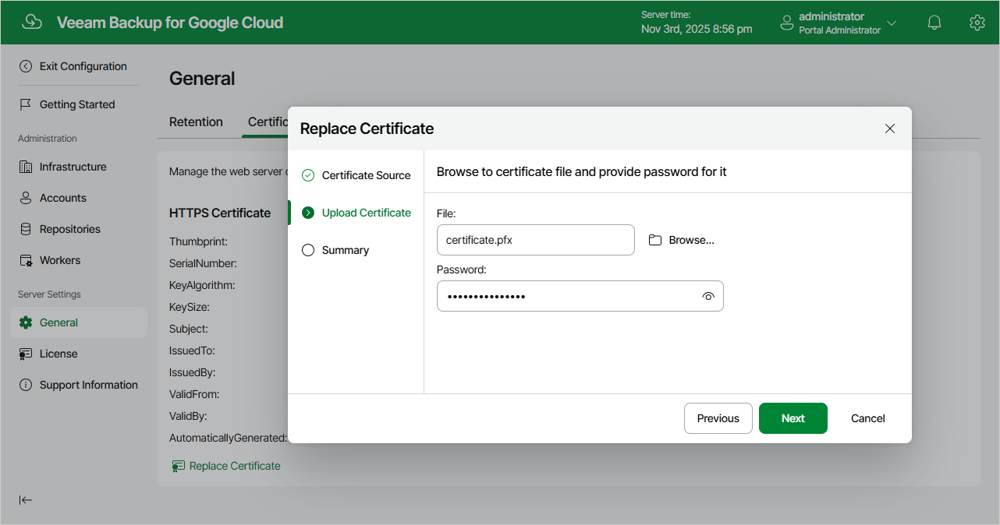

In this article

To establish secure data communications between the backup appliance and web browsers running on user workstations, Veeam Backup for Google Cloud uses Transport Layer Security (TLS) certificates.

When you install Veeam Backup for Google Cloud, it automatically generates a default self-signed certificate. You can replace this default certificate with your own self-signed certificate or with a certificate obtained from a Certificate Authority (CA). To replace the currently used TLS certificate, do the following:

1. Switch to the Configuration page.
2. Navigate to General > Certificate.
3. Click Replace Certificate.
4. Complete the Replace Certificate wizard:

1. At the Certificate Source step of the wizard, do the following:

* Select the Re-create the self-signed certificate option if you want to replace the existing certificate with a new self-signed certificate automatically generated by Veeam Backup for Google Cloud.
* Select the Upload a new certificate option if you want to upload a certificate that you obtained from a CA or generated using a 3rd party tool.

1. [Applies only if you have selected the Upload a new certificate option] At the Upload Certificate step of the wizard, browse to the certificate that you want to install, and provide a password for the certificate file.

|  |
| --- |
| Note |
| Only the PFX and P12 certificate formats are supported. |

1. At the Summary step of the wizard, review summary information and click Finish.

Page updated 11/12/2025

Page content applies to build 7.0.0.47
