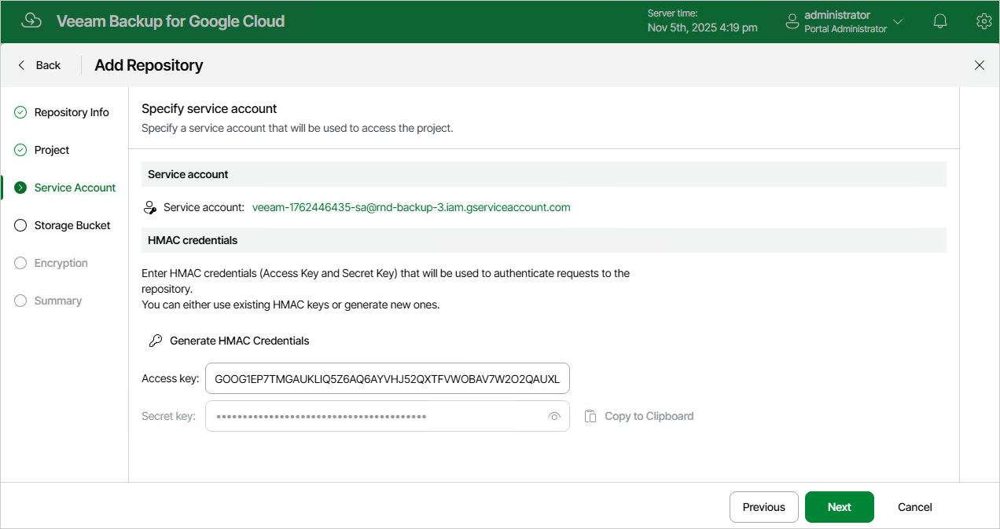

# Step 4. Specify Service Account

At the Service Account step of the wizard, do the following:

1. In the Service account section, click Choose to select a service account whose permissions Veeam Backup for Google Cloud will use to access the specified project. For more information on the required permissions, see [Service Account Permissions](repository_permissions.md).

For a service account to be displayed in the Service Accounts list, it must be added to Veeam Backup for Google Cloud as described in section [Adding Service Accounts](adding_service_accounts.md), and must be assigned permissions required to access the specified project as described in section [Adding Projects and Folders](adding_projects.md).

|  |
| --- |
| Important |
| The selected service account must belong to the same project as that you have specified at [step 3](repository_project.md) of the wizard. |

1. In the HMAC credentials section, use the Access key and Secret key fields to provide a Hash-based Message Authentication Code (HMAC) key associated with the account — Veeam Backup for Google Cloud will use the HMAC key to authenticate requests to the backup repository.

You can create the necessary HMAC key beforehand in the Google Cloud console as described in [Google Cloud documentation](https://cloud.google.com/storage/docs/authentication/managing-hmackeys#console_1). Alternatively, you can click Generate HMAC Credentials to create a new HMAC key and associate it with the service account without closing the Add Repository wizard.

