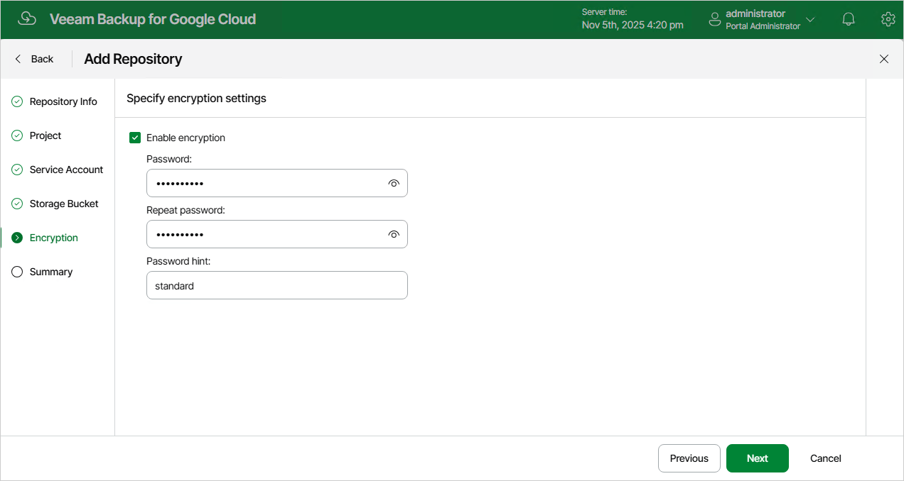

In this article

At the Encryption step of the wizard, choose whether you want to encrypt backups stored in the selected storage bucket. If you enable encryption, specify a password that will be used to encrypt data.

If you have selected an existing subdirectory at the Storage Bucket step of the wizard, you must provide the currently used password to let Veeam Backup for Google Cloud access this subdirectory and add it as a backup repository. You cannot change the encryption settings while adding the repository, but you will be able to [edit the repository settings](editing_repositories.md) later.

|  |
| --- |
| Important |
| After you create a repository with encryption enabled, you will not be able to disable encryption for this repository. However, you will still be able to change the encryption settings as described in section [Editing Backup Repositories](editing_repositories.md). |

Page updated 11/14/2025

Page content applies to build 7.0.0.47
