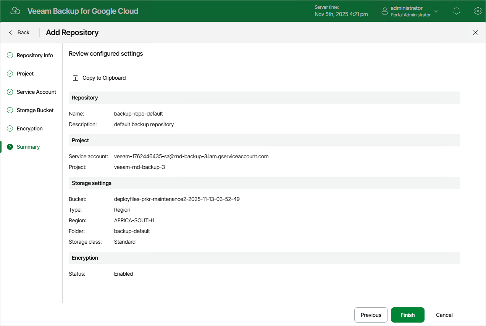

In this article

At the Summary step of the wizard, review summary information and click Finish.

As soon as you click Finish, Veeam Backup for Google Cloud will start creating the new backup repository. To track the progress, click Go to Sessions in the Session Info window to proceed to the [Session Logs page](viewing_session_statistics.md).

Page updated 11/14/2025

Page content applies to build 7.0.0.47
