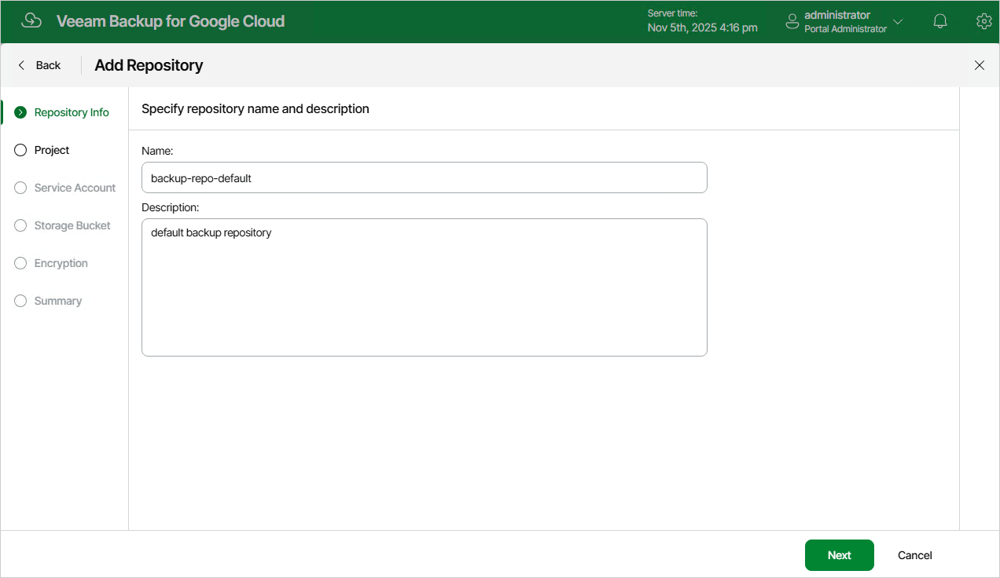

# Step 2. Specify Repository Name and Description

At the Repository Info step of the wizard, enter a name for the new backup repository and provide a description for future reference. The maximum length of the name is 127 characters; the following characters are not supported: \ / " ' [ ] : | < > + = ; , ? \* @ & \_ .

