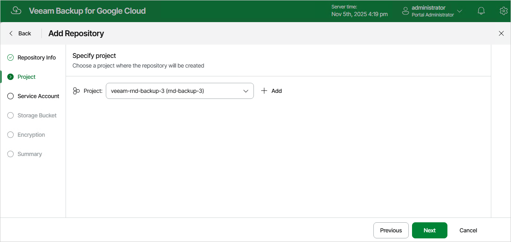

In this article

At the Project step of the wizard, select a project to which the new backup repository will belong.

For a project to be displayed in the Project list, it must be added to Veeam Backup for Google Cloud as described in section [Adding Projects and Folders](adding_projects.md). If you have not added the necessary project to Veeam Backup for Google Cloud beforehand, you can do it without closing the Add Repository wizard. To do that, click Add and complete the Add Projects and Folders wizard.

Page updated 11/14/2025

Page content applies to build 7.0.0.47
