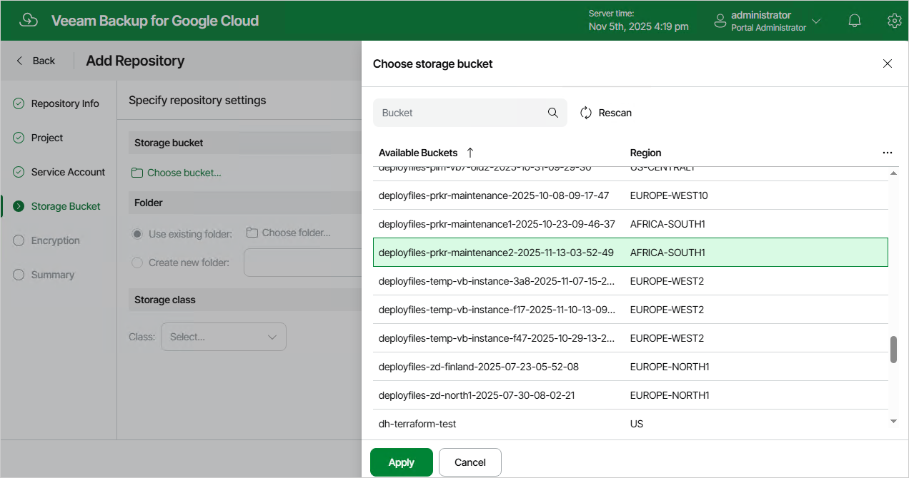

In this article

At the Storage Bucket step of the wizard, do the following:

1. In the Storage bucket section, click Choose bucket.

In the Choose storage bucket window, select a storage bucket that will be used as a target location for image-level backups of VM, Cloud SQL and Cloud Spanner instances, and click Apply.

For a storage bucket to be displayed in the Available Buckets list, it must be created for the selected project in the Google Cloud console as described in [Google Cloud documentation](https://cloud.google.com/storage/docs/creating-buckets).

1. In the Folder section, choose whether you want to use an existing subdirectory inside the selected storage bucket or to create a new one to group backups stored in the bucket.

* To use an existing subdirectory, select the Use existing folder option and click Choose folder. In the Choose folder window, select the necessary subdirectory and click Apply.

For a subdirectory to be displayed in the Available Folders list, it must be previously created by a backup appliance in the selected storage bucket.

|  |
| --- |
| Note |
| If you select an existing subdirectory for storing backup files, consider the following:   * The created backup repository will have the storage class that has been specified when creating the subdirectory. You cannot change the storage class for the repository. * If encryption at the repository level was enabled for the selected subdirectory, you must provide the password that was used to encrypt data at [step 6](repository_encryption.md) of the wizard.  * If the selected subdirectory already contains backups created by the Veeam backup service, Veeam Backup for Google Cloud will import the backed-up data to the configuration database. You can then use this data to perform all disaster recovery operations described in section [Performing Restore](performing_restore.md).   By default, Veeam Backup for Google Cloud applies retention settings saved in the backup metadata to the imported backups. However, if the selected subdirectory contains backups of resources that you plan to protect by a backup policy with the created repository specified as a backup target, Veeam Backup for Google Cloud will rewrite the saved retention settings and will apply to the imported backups new retention settings configured for that backup policy. |

* To create a new subdirectory, select the Create new folder option and specify a name for the subdirectory. The maximum length of the name is 127 characters; the following characters are not supported: \ / " ' [ ] : | < > + = ; , ? \* @ & \_ .

1. [Applies only if you have selected the Create new folder option] In the Storage class section, select a storage class for the backup repository — it can be either the Standard Storage, Nearline Storage or Archive Storage:

* To store backups in a high-performance, short-term storage that you plan to access frequently, select Standard.
* To store backups a high-durable, low-cost storage that you plan to access infrequently, select Nearline.
* To store backups in a cost-effective, long-term storage that you plan to access less than once a year, select Archive.

For the full description of Google Cloud storage classes, see [Google Cloud documentation](https://cloud.google.com/storage/docs/storage-classes).

|  |
| --- |
| Important |
| If you select the Archive option, you must also enable backup archiving for any backup policy that will store backups in this repository. For more information, see [Performing VM Backup](backup_policy_target.md), [Performing SQL Backup](sql_policy_target.md) and [Performing Spanner Backup](spanner_policy_target.md). |

Page updated 11/14/2025

Page content applies to build 7.0.0.47
