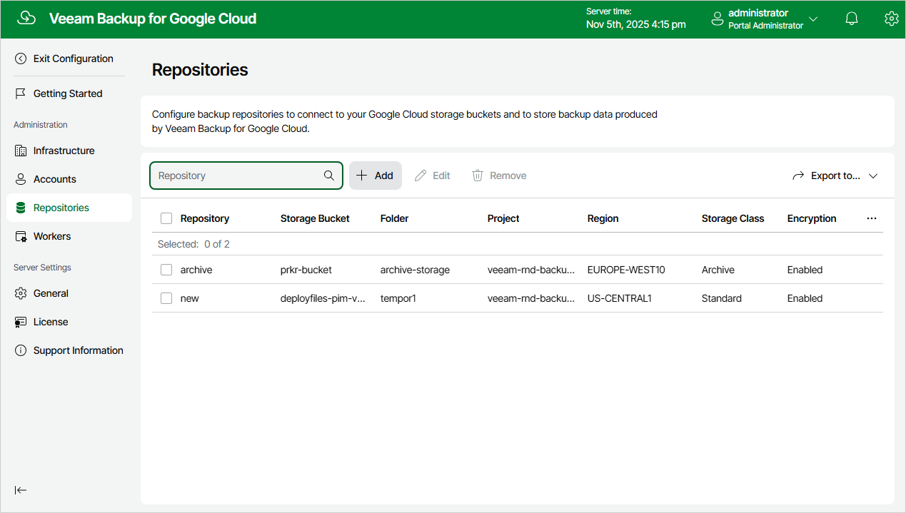

In this article

To launch the Add Repository wizard, do the following:

1. Switch to the Configuration page.
2. Navigate to Repositories.
3. Click Add.

Page updated 11/14/2025

Page content applies to build 7.0.0.47
