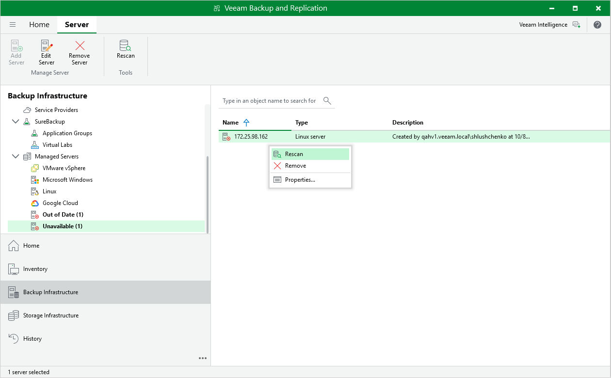

In this article

If a backup appliance becomes unavailable, for example, due to connectivity problems, you can rescan the appliance:

1. In the Veeam Backup & Replication console, open the Backup Infrastructure view.
2. Navigate to Managed Servers.
3. Select the necessary backup appliance and click Rescan appliance on the ribbon.

Alternatively, you can right-click the appliance and select Rescan.

1. In the opened window, click Yes.

Veeam Backup & Replication will remove all data collected from the appliance configuration database. Then, Veeam Backup & Replication will recollect session results for the past 24 hours, as well as information on all snapshots, backups and policies.

|  |
| --- |
| Note |
| The rescan operation cannot be performed for available backup appliances and appliances that require upgrade. To learn how to upgrade backup appliances, see [Upgrading Appliances](updating_vb.md). |

Page updated 11/14/2025

Page content applies to build 7.0.0.47
